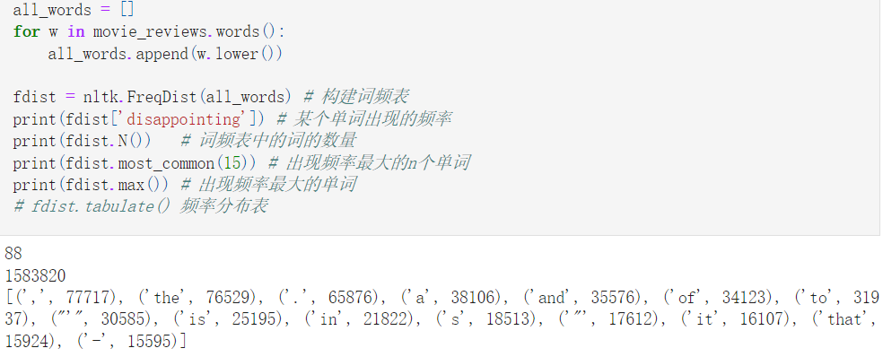
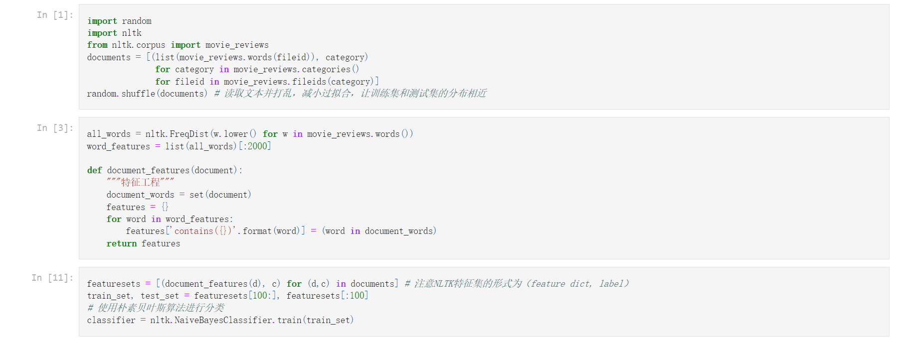
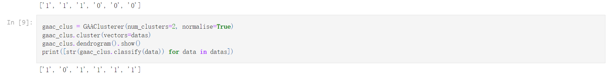

# NLTK调研报告
## 任务要求 
本次调研的基本任务如下：

基础任务:
1. 知道NLTK是啥，能做什么 
2. 了解所有可能的用途，跑通部分测试用例 

进阶任务：
1. 阅读代码，了解程序构造原理，类库结构
2. 分析背后的机器学习理论、方法和高效能编程最佳实践

## NLTK 介绍 

NLTK，全称Natural Language Toolkit，自然语言处理工具包，由宾夕法尼亚大学的Steven Bird和Edward Loper开发的模块。  
NLTK是构建Python程序以使用人类语言数据的领先平台。它为50多种语料库和词汇资源（如WordNet）提供了易于使用的界面，还提供了一套用于分类，标记化，词干化，标记，解析和语义推理的文本处理库。
NLTK是Python上著名的⾃然语⾔处理库 ⾃带语料库，具有词性分类库 ⾃带分类，分词，等等功能。NLTK被称为“使用Python进行教学和计算语言学工作的绝佳工具”，以及“用自然语言进行游戏的神奇图书馆”。
```
来自NLTK官网 www.NLTK.org
```

### NLTK 安装方法
安装方法：
```shell
pip install --user -U nltk
```
进入python后，使用nltk.download()根据弹出的界面自动下载需要的数据和package
```python
import nltk
nltk.download()
```

## NLTK功能分析

本部分主要参考的资料是NLTK的官方指导书 [NLTK BOOK](https://www.nltk.org/book/)

进行一个分类任务的简单流程可以参考仓库中的 功能分析/simple.ipynb

### NLTK的主要模块和功能 

下面两个表展示了NLTK包下的各个子包和子模块的功能和对应的自然语言处理任务 （按照字典序排序）  

对于NLTK包功能的详细分析聚焦于主要的自然语言处理任务 

| NLTK的子包   | 自然语言处理任务 | 功能                                             |
|-----------|----------|------------------------------------------------|
| app       | 应用       | 图形化交互式NLTK工具                                   |
| ccg       | 语义解析     | 组合范畴文法                                         |
| chat      | 应用       | 聊天机器人                                          |
| chunk     | 分块       | 使用正则表达式、n-gram、命名实体等方式进行分块                     |
| classify  | 分类任务     | 对文本进行分类（打标签）                                   |
| cluster   | 聚类任务     | K-means、EM、GAAC方法对文本进行聚类                       |
| corpus    | 访问语料库    | 通过该模块访问NLTK提供的语料库和词典                           |
| draw      | 应用       | 绘制NLTK的解析树                                     |
| inference | 语义解释     | 用于定理证明和模型检验                                    |
| lm        | 语言模型     | 目前只包含n-gram模型                                  |
| metrics   | 指标评估     | 对自然语言处理结果使用召回率等指标进行评估                          |
| parse     | 语法解析     | 使用图表或概率解析的方式生成语法树                              |
| sem       | 语义解释     | 使用一阶逻辑公式表示语义结构，在集合理论模型中进行评估                    |
| sentiment | 情感分析     | 使用NLTK内置特征和分类器对文本进行情感分析                        |
| stem      | 词干提取     | 抽取词的词干或词根形式                                    |
| tag       | 词性标注     | 使用n-gram，backoff，HMM等算法进行词性标注                  |
| tbl       | 机器学习     | 基于转换的机器学习(Transformation Based)，被BrillTagger使用 |
| test      | 测试       | NLTK内模块的单元测试                                   |
| tokenize  | 词元化      | 将文本按照不同粒度划分                                    |
| translate | 机器翻译     | 用于机器翻译任务的特征                                    |
| tree      | 文本结构     | 用于表示文本的语言结构，如语法树                               |
| twitter   | 应用       | 使用Twitter API检索Tweet文档                         |


| NLTK的子模块          | 功能                                  |
|-------------------|-------------------------------------|
| book              | NLTK的指导书                            |
| cli               | NLTK的命令行工具                          |
| collections       | NLTK实现的collection                   |
| collocations      | 识别词组的工具                             |
| compat            | 版本兼容                                |
| data              | 查找和加载NLTK提供的资源                      |
| decorators        | NLTK内置的decorator                    |
| downloader        | NLTK语料库和模块下载器                       |
| featstruct        | 文本特征结构的基本数据类和对特征结构进行基本操作的类          |
| grammar           | 表示上下文无关语法的基本数据类。                    |
| help              | NLTK使用帮助                            |
| internals         | NLTK内置的与java、字符串交互的工具               |
| jsontags          | 给数据打上JSON标记，便于downloader查找文件        |
| lazyimport        | 延迟模块导入，加速启动时间                       |
| probability       | 表示和处理概率信息的类                         |
| text              | 各种用于文本分析的功能：索引、正则表达式搜索等             |
| tgrep             | 用Tgrep算法搜索NLTK中的树结构                 |
| toolbox           | 用于读取、写入和操作工具箱数据库和设置文件，处理SIL工具箱格式的数据 |
| treeprettyprinter | 对于NLTK中树结构的漂亮的绘制                    |
| treetransforms    | 解析自然语言中的语法转换的方法集合                   |
| util              | 一些实用方法                              |
| wsd               | 为上下文中的歧义单词返回一个同义词集                  |

接下来按照自然语言处理的流程依次调研分析NLTK的功能

### 文本获取  
获取某一自然语言处理任务需要的文本，NLTK提供了大量的语料库适用于不同的自然语言处理任务，并提供接口下载这些语料库。可以通过corpus模块去访问语料库，以对象的方式读取语料库内的文本和附加的处理（词性标注、标签等）。

corpus是nltk内置的语料库，可以通过corpus访问不同语言、不同类型的语料库，在这些语料库上进行自然语言处理任务。许多文本语料库包含语言学注释，POS标签、命名实体、句法结构、语义角色等等


将语料库作为单词列表或者句子列表来访问，可以按照类别、文本名称等组织方式来读取语料库中的文本 NLTK的文本语料库按照不同的结构方式组织在一起：
+ 独立的文本，文本之间没有组织起来
+ 按照类别（类别之间不重叠）组织，如流派
+ 重叠的类别组织，如主题类别
+ 按照时间组织，如就职演讲语料库


NLTK支持用户导入自己的文本 通过``PlaintextCorpusReader``直接导入文本，访问语料库 如果有``Penn Treebank``对象的本地拷贝，可以通过``BracketParseCorpusReader``访问语料库

NLTK提供的语料库的形式有：
+ 单词列表
+ 表格，每一行是单词和单词的属性
+ 工具箱文件，工具箱文件由一组条目组成，其中每个条目由一个或多个字段组成


WordNet是面向语义的英语词典，NLTK提供了WordNet的语料库。使用WordNet可以查看单词的词义、同义词和反义词


WordNet同义词对应抽象的概念，它们在英语中并不总是有对应的单词。这些概念以层次结构连接在一起。


WordNet中的概念树中词与词之间有比较复杂的关系:
+ part词集包含这个词对应的事物的组成部分
+ substance词集表示这个词对应事物的材质
+ member词集则表示这个词对应事物的整体


WordNet中的同义词网络，使得不同的词可能共享同一个同义词超集，可以找到两个词之间最近的概念超集来估量这两个词词义上的联系和区别。


因为同义词网络是概念上的逐步具体化和细化，可以利用词在层次网络结构中的深度表示这个词的具体性或者说一般性。


衡量两个词之间的相似度同样可以通过层次网络中的路径的相似度来衡量


### 文本处理

获得文本后要对文本的格式等做一个规范化，将HTML等格式的文本转换为字符串形式，接下来要从文本中获取信息。

NLTK可以通过将文本转换为Text对象进行索引、查找等一系列操作

文本预处理旨在从文本中提取信息，将非结构化的文本转换为结构化的数据结构，信息提取的大致流程：
+ 使用句子分割器将原始文本划分为句子
+ 使用分词器（词元化方法）将句子划分为词
+ 对每个词进行词性标注，打上标签
+ 命名实体识别，识别已定义的实体（约定俗成的习语和专有名词）和未定义的实体
+ 进行文本中实体间关系的识别，搜索邻近实体对之间的特定模式，建立实体之间的关系图

```
NLTK不支持对中文进行分句、分词、词性标注等预处理操作，推荐的库有jieba
```

### 文本分割

第一步是将文本划分为句子和分词的代码都在NLTK的tokenizer模块中实现

NLTK基于不同的算法实现tokenizer，包括分句器、多种分词器、还有一些特殊的tokenizer，并在基础分词器、分局器的基础上进行扩展。

#### 分句

NLTK使用PunktSentenceTokenizer进行分句，这是一种使用无监督算法通过缩写词、固定搭配、标点符号和某些开始句子的固定的词进行训练的分句器。


#### 分词 

NLTK中的基础分词器包括：
+ RegexpTokenizer：使用正则表达式分词
+ ReppTokenizer：Repp分词器 http://anthology.aclweb.org/P/P12/P12-2.pdf#page=406
+ ToktokTokenizer：通用分词器
+ TreebankWordTokenizer：使用正则表达式对文本进行标记之后分词


NLTK支持简单分词（按照空格分词）以及按照行/空格/制表符进行分词的简单分词器


NLTK中还包括一些功能特殊的分词器:
+ SExprTokenizer：将句子按照括号分割
+ SyllableTokenizer：将词按照音节划分
+ TextTilingTokenizer：将文本中的每一段划分到其对应的子主题


### 统计分析

对于处理好的文本，可以使用NLTK中Text对象实现文本搜索和索引功能


NLTK可以根据文本中的词序列构建词频统计
+ 使用FreqDist词频表查看词的频率分布
+ ConditionalFreqDist条件词频表则可以为语料库的文本中的每个类别查看频率分布




NLTK可以通过绘图和表格对文本的频率分布进行可视化


### 词性标注

对于token序列可以进行一系列的操作帮助进一步分析句子的结构和语义，提取文本的特征  

基本的任务就是词性标注，按照token的含义、上下文内容和语法属性给token序列中每一个token打上标签（tag）  

NLTK在tag模块中根据多种机器学习算法实现了多种Tagger

NLTK中最简单的Tagger是DefaultTagger，给每个词用相同的Tag标注，这种标记方法毫无疑问效果是最差的


NLTK实现了正则表达式标注器Regular Expression Tagger，通过正则表达式进行模式匹配，对匹配特定模式的词标注上特定的Tag


Lookup Tagger是用文本中词频最高的若干个词的标记生成查找表，用这些信息去对文本进行标记，如果文本中的词不在查找表中，则使用默认标记。NLTK的实现为UnigramTagger。随着生成查找表的词语的数量增加，Lookup Tagger标注的准确率提高。


UnigramTagger(一元标注器)的实现基于一种简单算法：对于每个token，分配最可能用于该特定token的标记，可以通过给部分词性标注的数据给UnigramTagger进行训练（上面其实就是用词频最高的若干词进行训练）


N-Gram Tagging是Unigram Tagging的一般情况，通过前n个词的标记作为上下文来判断该词的标记。需要注意N-Gram碰到未出现的词、句的表现很糟糕（因为没有相对应的上下文）。当n变得很大时，每个上下文出现的次数都很少，数据比较稀疏，标记的准确率也会比较高，覆盖率比较低。这里用BigramTagger作为示例进行展示


NLTK可以将Tagger进行组合，准确性较强的Tagger进行一般的标记，当找不到词的标记时可以使用覆盖率更大的Tagger


CRFTagger根据条件随机场（CRF）算法进行词性标注的tagger 


PerceptronTagger根据感知器模型进行词性标注的tagger 


Brill Tagger基于转换进行词性标注。其总体思路非常简单：猜测每个词的标签，然后再回头修正错误。Brill Tagger基于正确标记的数据进行训练，通过维护一个转换修正规则的列表，错误的标记连续地转化为更正确的标记


### 词干提取和词性还原

词干提取和词性还原是将词标准化的过程，NLTK将这两部分集成在stem模块中  

词性还原是基于词典，将单词的复杂形态转变为最基础的形态，NLTK采用的词典是WordNet


词干提取则是去除词语的词缀，获得词根。
NLTK根据不同的词干提取算法，实现了不同的Stemmer，通过示例展示其用法，比较词干提取的结果：
+ ARLSTem：阿拉伯语词干提取
+ ARLSTem2：阿拉伯语词干提取
+ Cistem：德语词干提取
+ ISRIStemmer：基于ISRI阿拉伯语词干分析器的词干提取算法
+ LancasterStemmer：Lancaster算法，英文词干提取
+ PorterStemmer：Porter算法，英文词干提取
+ RegexpStemmer：正则表达式来识别词语的词缀
+ RSLPStemmer：葡萄牙语词干提取
+ SnowballStemmer：Snowball算法，支持多国语言


### 分块

基于token序列，可以对token序列进行分块(chunking)，如将组成名词短语、动词短语的词分在一起，对token序列进行命名实体识别任务等。

分块是NLP中进行实体检测的基本技术，对多词序列进行分段和标记，将共同表示某个含义的词分割在一起形成一个单元，NLTK在chunk模块中实现了分块的功能。

对于chunking而言，最有效的信息依据是词的pos tag。最简单的分块方法是自己定义一个模式，使用正则匹配的方法对词序列进行匹配，匹配该模式的词序列划分为一个块。下面是根据pos tag划分名字短语的示例，分块的结果将识别到的NP用()划分在一起


Chinking方法将满足条件的token序列从块中删除从而进行分块（以删除的方式进行分块而不是划分的方式）。简单的示例如下，下面的分块方法里匹配第一个模式的token序列会作为一个NP，匹配第二个模式的token序列会被删除


NLTK可以对分块器的分块结果进行评估，可以对分块结果的Precision，Recall，F_Meature进行评估，IOB Accuracy表示IOB准确率，可以认为是分块准确率


通过扩展ChunkParserI接口，可以设计自己的分块器。下面通过Unigram的tag，根据Unigram的词性标注结果进行分块 可以将Unigram扩展到Bigram和N-gram


句子中token词性的标注无法完全决定句子分块的方式，需要将词的语义内容也作为分块的依据之一，基于这种方式可以使用基于分类器的tagger对句子进行分块 代码示例如下：


命名实体是指特定类型的名词短语，如组织、个人、日期等。 命名实体识别要识别文本中的所有命名实体，是一种特殊的分块任务：
+ 识别命名实体的边界
+ 识别命名实体的类型

命名实体识别适用于基于分类器的方法，根据词性标记和词义信息进行命名实体识别。NLTK提供了内置的命名实体识别器ne_chunk进行命名实体识别，其中binary参数为True将命名实体标记为NE，否则添加类别标签。


命名实体关系的识别可以通过模式匹配，即识别满足特定模式的两个命名实体 如A in B就是一个可行的模式，体现了两个命名实体之间的包含关系。以下是使用NLTK进行命名实体关系识别的示例，通过nltk.sem.extract_rels识别文本中命名实体之间的关系，通过nltk.sem.rtuple提取元组进行输出


### 句法分析

句法分析分析句子的句法结构（主谓宾结构）和词汇间的依存关系，从而为语义分析、情感分析等自然语言任务打基础。

NLTK在Parser模块中实现句法分析的功能，可以将句子转变为语法树，展示句子的语法结构

NLTK中可以自行定义上下文无关文法解析句子的结构，NLTK根据上下文无关文法的定义生成parser对句子进行解析，生成若干棵树表示根据文法解析出的不同的结构。在下文的示例中使用上下文无关文法进行语法分析时发现例句有两种不同的结构，代表其可能有两种不同的意思

NLTK中可以自行定义上下文无关文法解析句子的结构， NLTK根据上下文无关文法的定义生成parser对句子进行解析，生成若干棵树表示根据文法解析出的不同的结构 在下文的示例中使用上下文无关文法进行语法分析时发现例句有两种不同的结构，代表其可能有两种不同的意思


使用上下文无关文法对句子进行解析时，NLTK内置了不同的解析算法：
+ 递归向下分析：Recursive Descent Parsing
+ 移进-归约分析：Shift-Reduce Parsing


同时NLTK还支持扩展的上下文无关文法，需要注意不同的上下文无关文法需要使用对应的parser
+ 依存关系和依存文法 Dependencies and Dependency Grammar，关注词和词之间的关系
+ 概率上下文无关文法 Probabilistic Context Free Grammar，分析树中引入了概率，返回概率最大的解析


NLTK实现的基础句法解析器包括ChartParser，CoreNLPParser，MaltParser，ProbabilisticNonprojectiveParser，RecursiveDescentParser，ShiftReduceParser   

NLTK基于这些基础的句法解析器实现多种更高效、更准确的句法解析器，因为数量太多而不一一列举


NLTK支持创建自定义的特征结构并对其进行操作


### 语义分析

自然语言处理中对句子进行语义分析，分为两部分：

#### 词汇级

词汇级语义分析：对词的含义进行分析，主要是消除词在句子中的歧义，找到词在句中最合适的语义 

关于词汇的含义，NLTK提供了WordNet语料库，该语料库包含了词汇的含义，在含义层面上对词与词之间的关系使用层级结构进行表示，可以参照上文的获取语料部分。

#### 句子级

句子级语义分析：对于句子整体的含义进行分析  

NLTK中对于句子可以通过命题逻辑分析其语义，对其进行验证和推理 

对语句含义的理解可以考虑通过语法将其转换为计算机更容易理解的语言，NLTK内置了很多文法进行语言的简单翻译。如下边的示例根据NLTK中内置的文法，将自然语言转换为SQL语句


NLTK可以将语言用逻辑语言进行表达，通过命题逻辑推理语言的含义。NLTK用命题逻辑表示语言结构中和特定句子连接词相对应的部分。

NLTK可以将逻辑表达式转换为Expression对象，通过NLTK的推理模块对Expression进行逻辑证明。

Expression对象提供了satisfiers方法，返回满足公式的所有个体的合集，可以判断某个集合内的变量中满足公式成立条件的变量有哪些


NLTK通过Valuation对象来确定逻辑表达式的真值


NLTK可以通过将自然语言表达式转换为一阶逻辑来表达语句的含义 一阶逻辑保留命题逻辑的所有布尔运算，将识别命题中的谓词和参数进行分析 一阶逻辑表达式的语法结构通常是为表达式分配类型：实体类型和公式类型 一阶逻辑也可以通过Prover9进行逻辑证明 以下是代码示例


基于上述对象和方法，NLTK就可以通过一阶逻辑对句子进行语义分析，如判断某个句子是否有歧义


### 分类

基于上述对自然语言文本的分析，可以从文本中提取特征从而对文本进行分类，如情感分析等  



NLTK中提供了多种度量指标来对分类器的分类结果进行度量


NLTK在classifer模块中根据多种机器学习算法实现了不同的Classifier

下面展示决策树、朴素贝叶斯、最大熵分类器三种经典的机器学习中的分类器


Scikit-Learn库是Python中的机器学习库，提供了大量的机器学习算法，NLTK中可以通过SklearnClassifier使用sklearn模块的分类器


### 聚类

NLTK实现了多种算法对文本进行聚类，将多个文本以无监督的方式分为不同的类 

NLTK实现了三种常见的聚类方法：
+ KMeans（K均值）
+ 混合高斯聚类（EM）
+ GAAC（凝聚层次聚类法）

> 这里需要注意 聚类器传入数据的要求是numpy的array类型

这里使用三种聚类器对NLTK内置语料库中的电影评论进行聚类




## 代码架构

NLTK的各个功能实现在各个包里，大部分包（chunk、tag、tokenize、classify等等）集成了解决对应自然语言处理任务的多种机器学习算法的实现。   

NLTK的实现上，每个功能包会暴露一个默认的功能方法，因此可以通过这些方法直接调用默认的模型执行某些自然语言处理任务，如tag包就会将pos_tag方法和pos_tag_sents方法暴露出去，这两个方法使用感知器作为默认Tagger进行词性标注，可以在主包中直接调用两个方法进行词性标注。
```python
import NLTK
NLTK.pos_tag(tokens)
NLTK.pos_tag_sents(sents)
```

这些包整体上按照接口模式进行架构，每一个包对应一种自然语言处理任务：
+ api.py文件中定义了接口，包含特定自然语言任务需要的方法和常量。通过接口，使用者可以用统一的方式使用统一的方法完成相应的任务。包中的所有模型都应该实现接口中定义的所有方法。
+ util.py文件中定义了多个模型需要的通用的工具方法。
+ 其余每个文件对应了一种特定自然语言处理任务的算法的实现，每个模型都需要基于接口定义的方法来实现对应的算法。文件的内容包含两个部分：第一部分是算法实现有关的类，第二部分是类需要的工具方法和使用示例方法。

### 架构示例

下面以tag包为例，展示这种架构

tag包中的api.py文件定义了TaggerI接口，其中注解为@abstractmethod是需要模型实现的抽象方法，其他没有注解的方法则是基于抽象方法实现的功能方法。

python语言没有接口相关的定义，python通过抽象类实现Interface，通过抽象方法定义接口的派生类需要实现的方法。

#### 接口定义

TaggerI接口可以看成是对整个Tag任务的功能抽象，可以对Tag任务进行进一步抽象，如将基于特征集进行Tag任务的模型进行抽象，得到FeaturesetTaggerI接口，这里需要注意FeaturesetTaggerI是基于TaggerI定义的，是TaggerI的子类。

TaggerI接口中包含了Tag任务中需要的所有的功能。

```python
class TaggerI(metaclass=ABCMeta):
    """
    给token序列中的每个token打上标记
    """

    @abstractmethod
    def tag(self, tokens):
        """
        采用某一标记算法给token序列打上标记，返回标记后的token序列
        """

    def tag_sents(self, sentences):
        """
        给句子序列中的每一句（一句对应一个token序列）打标记
        """

    @deprecated("Use accuracy(gold) instead.")
    def evaluate(self, gold):
        return self.accuracy(gold)

    def accuracy(self, gold):
        """
        将gold作为正确的标注结果，计算实际标注结果的准确率
        """

    @lru_cache(maxsize=1)
    def _confusion_cached(self, gold):
        """
        将gold作为正确的标注结果，计算实际标注结果对应的混淆矩阵
        """

    def confusion(self, gold):
        """
        封装_confusion_cached，给外界调用
        """

    def recall(self, gold) -> Dict[str, float]:
        """
        将gold作为正确的标注结果，计算实际标注结果的召回率
        """

    def precision(self, gold):
        """
        将gold作为正确的标注结果，计算实际标注结果的精确率
        """

    def f_measure(self, gold, alpha=0.5):
        """
        将gold作为正确的标注结果，计算实际标注结果的f-score，alpha为计算中false-negative的权重
        """

    def evaluate_per_tag(self, gold, alpha=0.5, truncate=None, sort_by_count=False):
        """
        对于每个tag计算其对应的recall、precision和f-score，并用表格的形式展示
        """
```

#### 工具方法

util.py文件中则定义了Tag任务需要使用的工具方法

```python
def str2tuple(s, sep="/"):
    """
    将带标记的字符串形式的token转换为tuple
    """

def tuple2str(tagged_token, sep="/"):
    """
    将带标记的tuple形式的token转换为字符串
    """

def untag(tagged_sentence):
    """
    对于已经标记的句子，返回这个句子未标记的版本
    """
```

#### 模型实现

在tag包中基于感知机``percptron``、条件随机场``crf``、隐马尔可夫链``HMM``等算法实现Tagger来处理词性标注Tag任务，每一个实际进行Tag任务的Tagger类都需要以TaggerI或FeatureTaggerI为父类

```python
class HiddenMarkovModelTagger(TaggerI):
    pass

class CRFTagger(TaggerI):
    pass 

class BrillTagger(TaggerI):
    pass 

class PerceptronTagger(TaggerI):
    pass 

class StanfordTagger(TaggerI):
    pass
```

## 高性能实践

### 懒惰机制

为了减少运行时间，NLTK中大量使用了懒惰机制，即将部分工作推迟到不得不进行该工作的时候进行。这样可以减少代码的运行时间和存储消耗，提高性能。

#### LazyImport

为了加速代码的启动时间，NLTK使用LazyImport的方式，直到代码从模块的命名空间中请求某个属性（对象或方法）时，这一属性才会实际导入到项目中。

LazyImport的实现在``lazyimport.py``文件中

主要两个方法如下，无论是获取属性还是修改属性，都会在实际请求属性（即__getattr__和__setattr__调用时）import对应的模块属性

```python
def __getattr__(self, name):

        """Import the module on demand and get the attribute."""
        if self.__lazymodule_loaded:
            raise AttributeError(name)
        if _debug:
            print(
                "LazyModule: "
                "Module load triggered by attribute %r read access" % name
            )
        module = self.__lazymodule_import()
        return getattr(module, name)

    def __setattr__(self, name, value):

        """Import the module on demand and set the attribute."""
        if not self.__lazymodule_init:
            self.__dict__[name] = value
            return
        if self.__lazymodule_loaded:
            self.__lazymodule_locals[self.__lazymodule_name] = value
            self.__dict__[name] = value
            return
        if _debug:
            print(
                "LazyModule: "
                "Module load triggered by attribute %r write access" % name
            )
        module = self.__lazymodule_import()
        setattr(module, name, value)
```

#### Lazy Collection

为了提高Collection集合工具的性能，NLTK通过懒惰机制，重写了主要的几个Collection，LazyCollection的特点在于根据需要计算collection中的值，主要用于对语料库（corpus）的访问，只需要从磁盘文件中需要的语料库部分内容，而不是将整个语料库加载到内存中。

这些LazyCollection都基于虚类``AbstractLazySequence``进行实现，包括
+ ``LazySubsequence``
+ ``LazyConcatenation``
+ ``LazyMap``
+ ``LazyZip``
+ ``LazyEnumerate``
+ ``LazyIteratorList``

``LazyMap``可以看成是一个序列和对某个序列在某个函数的上映射，在``LazyMap``的实现中只有在访问到对应的值时才会使用函数对这个值进行映射，未访问情况下只会存储原始序列。而python内置的Map在初始化时就会计算序列中所有值的映射值，占据更多的内存。  

如对corpus中的tokens进行分类，对应的featureset可能会占用大量内存，所以可以在训练和使用分类器时使用``LazyMap``来减小内存的占用量。
```python
class LazyMap(AbstractLazySequence):
    def iterate_from(self, index):
        # Special case: one lazy sublist
        if len(self._lists) == 1 and self._all_lazy:
            for value in self._lists[0].iterate_from(index):
                yield self._func(value)
            return

        # Special case: one non-lazy sublist
        elif len(self._lists) == 1:
            while True:
                try:
                    yield self._func(self._lists[0][index])
                except IndexError:
                    return
                index += 1

        # Special case: n lazy sublists
        elif self._all_lazy:
            iterators = [lst.iterate_from(index) for lst in self._lists]
            while True:
                elements = []
                for iterator in iterators:
                    try:
                        elements.append(next(iterator))
                    except:  # FIXME: What is this except really catching? StopIteration?
                        elements.append(None)
                if elements == [None] * len(self._lists):
                    return
                yield self._func(*elements)
                index += 1

        # general case
        else:
            while True:
                try:
                    elements = [lst[index] for lst in self._lists]
                except IndexError:
                    elements = [None] * len(self._lists)
                    for i, lst in enumerate(self._lists):
                        try:
                            elements[i] = lst[index]
                        except IndexError:
                            pass
                    if elements == [None] * len(self._lists):
                        return
                yield self._func(*elements) # 在遍历的时候才会调用func
                index += 1
```

#### Lazy DataLoader

此外，NLTK通过``LazyLoader``支持对于数据集访问的懒惰访问，即只有需要读取对应的数据时才会将数据从磁盘Load到内存。  

通过这种方式加载数据一方面减小了内存占用量（可以一次加载少量数据），另外一方面可以加速代码的运行（加载数据和数据处理如模型的训练等并行）

### 自定义数据结构

为了统一数据的管理，NLTK自定义了很多数据结构并对python原生的数据结构进行扩展，规范化数据的处理形式和展示形式，举例如下：
+ 概率分布、频率分布相关的数据结构定义在``probability.py``文件中，数据结构有：``FreqDist``和基于``ProbDistI``扩展的各种概率分布数据结构如``MLEProbDist``、``LidStoneProbDist``等等
+ 与特征有关的数据结构定义在``featstruct.py``中，主要是``FeatStruct``、``Feature``、``CustomFeatureValue``这三个基本的数据结构与其扩展的数据结构
+ ``decorators.py``中扩展了python原生的装饰器

通过这种方式，NLTK将自然语言处理相关的数据结构规范化，可以通过NLTK的数据结构和模型完成从文本读取到自然语言处理任务执行整个流程而无需引入额外的包。大大减小了对外部库的依赖性和用户的学习成本，提高了使用上的便利性。

## NLP理论

以基于隐马尔可夫链算法实现的模型HiddenMarkovModelTagger为例，分析NLTK对特定机器学习算法的实现 

参考资料：
+ https://blog.csdn.net/u014688145/article/details/53046765
+ https://zhuanlan.zhihu.com/p/88362664

### 基本性质

隐马尔可夫模型HMM主要用于为数据序列中的每一个数据分配正确的标签和评估根据数据序列生成给定标签序列的概率。   

#### HMM的理论基础

HMM通过从可观察的标签序列中确定标签序列生成过程中的隐含的状态，利用这些状态和状态-标签之间转换的概率进行进一步的分析。

HMM基于马尔可夫链的假设，从一个状态转换到另一个状态的概率只取决于当前状态。

#### HMM的特征和计算

HMM模型是有限状态机，其中的特征是状态、状态之间的转换和每个状态输出的标签符号。  

HMM基于Viterbi算法找到给定状态序列生成的最大概率的标签序列。

#### HMM的特征

基于以上内容，可以看出HMM具有时不变性质，即将HMM中的状态序列进行位移生成的标签序列等于HMM基于位移前的状态序列生成的标签序列在内容上是一致的。（时间的变化不会影响标签序列的生成）

### HMM特征表示

HMM本质上是一个有向图，每条边的权重为概率（状态到标签的概率，状态到状态的概率），每个状态会非确定性的生成一个标签，外界可以看到HMM的输出的标签序列，对应的状态序列不可见，


计算过程中HMM的特征如下：
+ 输出的标签序列
+ 状态集 
+ 从某一状态转换到另一个状态的概率 $a_{ij} = P(s_t = j | s_{t-1} = i), s_t$为t时刻的状态
+ 从某一状态生成某一标签的概率 $b_i(k) = P(o_t = k | s_t = i), o_t$为t时刻的标签
+ 初始状态概率分布，第一个状态是某一状态的概率 

### 具体实现

HMM分为两个部分，第一部分是使用HMM进行标签序列的生成，第二部分是训练HMM，找到最合适的的状态参数。

下面解析HiddenMarkovModelTagger中的主要方法和实现方式。

这里需要注意，对于词性标注任务，状态是word，标签是tag

NLTK中HMM的生成和训练如下：
```python
class HiddenMarkovModelTagger(TaggerI):
    """
    HiddenMarkovModelTagger的初始化需要以下参数
    symbols：标签序列
    states：状态序列，需要自己给出
    transitions：从某一状态转换到另一个状态的概率，基于ConditionalProbDistI接口
    outputs：从某一状态生成某一标签的概率，基于ConditionalProbDistI
    priors：初始状态的概率分布，基于ProbDistI
    transform：用于转换状态序列，可选，默认不做任何转换
    """

    def __init__(
        self, symbols, states, transitions, outputs, priors, transform=_identity
    ):
        # 将状态集和标签集去重
        self._symbols = unique_list(symbols) 
        self._states = unique_list(states) 
        self._transitions = transitions
        self._outputs = outputs
        self._priors = priors
        self._cache = None
        self._transform = transform

    @classmethod
    def _train(
        cls, labeled_sequence, test_sequence=None, unlabeled_sequence=None, transform=_identity, estimator=None, **kwargs,
    ):
        # HMM的训练过程，这里需要注意，对于带有标签的状态序列使用监督学习模式
        if estimator is None:
            def estimator(fd, bins):
                return LidstoneProbDist(fd, 0.1, bins)

        labeled_sequence = LazyMap(transform, labeled_sequence)
        symbols = unique_list(word for sent in labeled_sequence for word, tag in sent)
        tag_set = unique_list(tag for sent in labeled_sequence for word, tag in sent)

        trainer = HiddenMarkovModelTrainer(tag_set, symbols)
        # 监督学习方法根据带标签的状态序列，训练生成多个概率矩阵（初始概率，状态转移概率，状态生成标签概率）
        hmm = trainer.train_supervised(labeled_sequence, estimator=estimator)
        hmm = cls(
            hmm._symbols,
            hmm._states,
            hmm._transitions,
            hmm._outputs,
            hmm._priors,
            transform=transform,
        )

        if test_sequence:
            hmm.test(test_sequence, verbose=kwargs.get("verbose", False))

        if unlabeled_sequence:
            max_iterations = kwargs.get("max_iterations", 5)
            # 如果存在无标签的状态序列，在原模型的基础上使用无监督学习加强训练，并进行测试
            hmm = trainer.train_unsupervised(
                unlabeled_sequence, model=hmm, max_iterations=max_iterations
            )
            if test_sequence:
                hmm.test(test_sequence, verbose=kwargs.get("verbose", False))

        return hmm
```

HMM的应用主要有三个方面的问题：

#### 应用问题：
已知模型参数和标签序列的情况下（状态序列是否已知不重要），计算标签序列出现的概率

HMM通过probability方法计算标签序列出现的概率，采用前向或者后向算法进行计算，代码中采用前向算法

```python
    def probability(self, sequence):
        return 2 ** (self.log_probability(self._transform(sequence)))

    def log_probability(self, sequence):
        """
        如果sequence是带有标签的状态序列，返回sequence中的状态序列生成标签序列的概率，

        如果sequence是不带状态的标签序列，计算标签序列出现概率的方法是，算出每个可能的状态序列生成标签序列的概率并求和。
        等价于：返回标签序列生成最后一个状态（最后一个状态可能是标签集合中任意一个标签）的概率之和

        因为序列长度比较长时，序列生成概率比较小，所以这里用对数的形式计算使得最后的结果更精准
        """
        sequence = self._transform(sequence) # 对序列进行转换，默认不转换

        T = len(sequence)

        if T > 0 and sequence[0][_TAG]:
            # 第一个标签的概率的对数为生成第一个状态的概率的对数加上第一个状态生成第一个标签的概率
            last_state = sequence[0][_TAG]
            p = self._priors.logprob(last_state) + self._output_logprob(
                last_state, sequence[0][_TEXT]
            ) 
            # 生成第i个标签的概率的对数为第i-1个状态转换到第i个状态的概率的对数加上第i个状态生成第i个标签的概率
            for t in range(1, T):
                state = sequence[t][_TAG]
                p += self._transitions[last_state].logprob(
                    state
                ) + self._output_logprob(state, sequence[t][_TEXT])
                last_state = state
            return p
        else:
            alpha = self._forward_probability(sequence)
            p = logsumexp2(alpha[T - 1])
            return p
```
前向算法是一个递推算法
+ 标签序列记为$[t_1, t_2, ..., t_T]$，状态序列为$[s_1, s_2, ..., s_T]$，状态集为$[o_1, o_2, ..., o_N]$，这里$t_i$是固定值，$s_i$非定值
+ $transition[i, k] = log(P(s_n = o_k | s_{n-1} = o_i)), n - 1 > 0$
+ $\lambda$表示模型中的参数

```
注意，为了方便推导，推导过程中的所有矩阵的下标和代码里的下标不一致
推到过程中矩阵下标从1开始，代码里从0开始
```

前向算法用alpha矩阵计算标签序列的概率，alpha矩阵为 T x N矩阵（T为序列长度，N为状态集大小），矩阵中的某个元素用来表示标签序列的某个前缀序列对应的状态序列最后一个状态为某个特定状态的概率。因为生成概率经过不断的乘法累积会变得比较小，所以用对数表示会更加方便计算。
+ $alpha[n, k] = log(P(t_1, t_2, ..., t_n, s_n = o_k | \lambda))$
+ $alpha[1, k] = log(P(s_1 = o_k | \lambda) * P(t_1 | s_1 = o_k))$

注意到对于长度为n的标签序列，其状态序列中最后一个状态为o_k的概率，为所有的前继状态（第n-1个状态）的概率乘以前继状态转移到o_k的概率再乘以o_k生成第n个标签的概率之和。具体推导如下：
+ $P(t_1, t_2, ..., t_n, s_n = o_k | \lambda) = \sum_{i=1}^N P(t_1, t_2, ..., t_{n-1}, s_n = o_i | \lambda) * P(s_n = o_k | s_{n-1} = o_i) * P(t_n | s_n = o_k) $
+ $alpha[n, k] = log(2^{output[k, t_n]} * \sum_{i=1}^N 2^{alpha[n-1,i] + transition[i, k]})$ 

```python
     def _forward_probability(self, unlabeled_sequence):
        T = len(unlabeled_sequence)
        N = len(self._states)
        alpha = _ninf_array((T, N))

        transitions_logprob = self._transitions_matrix()

        # Initialization
        # alpha[0, k]等于状态k的初始生成概率和状态k生成第一个标签的概率
        symbol = unlabeled_sequence[0][_TEXT]
        for i, state in enumerate(self._states):
            alpha[0, i] = self._priors.logprob(state) + self._output_logprob(
                state, symbol
            )

        # 不断前向传播，alpha[t, k]的概率为 第t-1个状态为任意状态i的概率乘以状态i转移到状态k的概率再求和，最后乘以状态k生成第k个标签的概率
        # 这里注意保存的概率是概率的对数，所以在计算下一个概率的对数的时候需要用logsumexp2计算
        for t in range(1, T):
            symbol = unlabeled_sequence[t][_TEXT]
            output_logprob = self._outputs_vector(symbol)

            for i in range(N):
                summand = alpha[t - 1] + transitions_logprob[i]
                alpha[t, i] = logsumexp2(summand) + output_logprob[i]

        return alpha
```

后向算法也是递推算法
+ 标签序列记为$[t_1, t_2, ..., t_T]$，状态序列为$[s_1, s_2, ..., s_T]$，状态集为$[o_1, o_2, ..., o_N]$，这里$t_i$是固定值，$s_i$非定值
+ $transition[i, k] = log(P(s_n = o_k | s_{n-1} = o_i)), n - 1 > 0$
+ $prior[i] = log(P(s_1 = o_i | \lambda))$

后向算法从后往前进行递推，beta矩阵表示某个后缀标签序列的前一个状态为某个特定状态的概率，即后面的标签序列为$[t_{n+1}, ..., t_T]$时，第n个状态为某一特定状态的概率，表达式如下：
+ $beta[n, k] = log(P(t_T, t_{T-1}, ..., t_{n+1} | s_n = o_k , \lambda))$
+ $beta[T, k] = log(1)$

递推方式的推导过程如下：
+ $P(t_T, t_{T-1}, ..., t_{n+1} | s_n = o_k , \lambda) = \sum_{i=1}^N P(t_T, t_{T-1}, ..., t_{n+1}, s_{n+1} = o_i | s_n = o_k , \lambda) = \sum_{i=1}^N P(t_T, t_{T-1}, ..., t_{n+2} | s_{n+1} = o_i, \lambda) * P (s_{n+1} = o_i | s_n = o_k) * P(t_{n+1} | s_{n + 1} = o_i) $
+ $beta[n, k] = log(P(t_T, t_{T-1}, ..., t_{n+1} | s_n = o_k , \lambda)) = log(\sum_{i=1}^N 2^{transition[i, k] * P(t_{n+1} | s_{n + 1} = o_i) * beta[n + 1, i]})$
+ 最终概率$P = \sum_{i=1}^N beta[1, i] * prior[i] * P(t_1 | s_1 = o_i)$

```python
    def _backward_probability(self, unlabeled_sequence):
        T = len(unlabeled_sequence)
        N = len(self._states)
        beta = _ninf_array((T, N))

        transitions_logprob = self._transitions_matrix().T

        # initialise the backward values;
        # "1" is an arbitrarily chosen value from Rabiner tutorial
        beta[T - 1, :] = np.log2(1)

        # inductively calculate remaining backward values
        for t in range(T - 2, -1, -1):
            symbol = unlabeled_sequence[t + 1][_TEXT]
            outputs = self._outputs_vector(symbol)

            for i in range(N):
                summand = transitions_logprob[i] + beta[t + 1] + outputs
                beta[t, i] = logsumexp2(summand)

        return beta
```

#### 预测问题：
也叫做解码问题，已知模型参数和标签序列，找到最可能的状态序列，使用Viterbi算法求解  

对于长度为T的标签序列，状态集的大小为N，则可能的状态序列的数量为$N^T$个，每个状态序列生成这个标签序列的概率是不同的，找到概率最大的那个状态序列。  
对应的Viterbi算法如下：
+ 标签序列记为$[t_1, t_2, ..., t_T]$，可能的状态序列为$[s_1, s_2, ..., s_T]$，状态集为$[o_1, o_2, ..., o_N]$
+ $P(t_1, t_2, ..., t_n | s_1, ..., s_n) = P(t_1, t_2, ..., t_{n-1} | s_1, s_2, ..., s_{n-1}) * P(s_n | s_{n-1}) * P(t_n | s_n) $
+ $V[n, k] = max(P(t_1, t_2, ..., t_n, s_n = o_k)) $即第n个状态为$o_k$的序列中最可能生成$[t_1, t_2, ..., t_n]$的状态序列的概率
+ $V[n, k] = max(V[n - 1, i] * X(o_i, o_k)) * O(o_k, t_n), i \in {1, ..., N}$

```python
    def _best_path(self, unlabeled_sequence):
        """
        unlabeled_sequence为一个标签序列，该函数负责找到最有可能的状态序列（状态序列生成这个标签序列的可能性最大）
        The cache is a tuple (P, O, X, S) where:
          - S 代表标签字典，一个标签对应一个序号
          - O 代表状态生成标签概率矩阵
          - X 代表状态转移概率矩阵
          - P 代表第一个状态是状态k的概率
        整体的算法如下：动态规划算法
        标签序列记为[t1, t2]
        最重要找的状态序列是[a1, a2, ..., at]这个序列在所有的序列中生成这个标签序列的可能性最大
        """
        unlabeled_sequence = self._transform(unlabeled_sequence)
        T = len(unlabeled_sequence)
        N = len(self._states)
        # 使用cache缓存计算所需的参数
        self._create_cache()
        self._update_cache(unlabeled_sequence)
        P, O, X, S = self._cache

        V = np.zeros((T, N), np.float32) # V[t, k] 根据前t个标签的序列生成的若干状态序列[a1, a2, ..., at = k]中概率最大的状态序列的概率 
        B = -np.ones((T, N), int) # B[t, k]  V[t, k]对应的序列中第t-1个状态

        V[0] = P + O[:, S[unlabeled_sequence[0]]]
        for t in range(1, T):
            for j in range(N):
                vs = V[t - 1, :] + X[:, j]
                best = np.argmax(vs) # 找到概率最大的状态序列
                V[t, j] = vs[best] + O[j, S[unlabeled_sequence[t]]]
                B[t, j] = best

        # 倒序找到概率最大的状态序列
        current = np.argmax(V[T - 1, :])
        sequence = [current]
        for t in range(T - 1, 0, -1):
            last = B[t, current]
            sequence.append(last)
            current = last

        sequence.reverse()
        return list(map(self._states.__getitem__, sequence))
```
#### 熵
HMM支持计算标签序列的熵
+ 信息熵的计算为 $\sum p * log(p)$
+ 熵的计算方法为$\sum P(s_1, s_2, ..., s_T | t_1, t_2, ..., t_T) log(P(s_1, s_2, ..., s_n| t_1, t_2, ..., t_T)$
+ 这里计算就是根据标签序列生成状态序列的概率计算熵
+ $P(t_1, t_2, ..., t_T)$即标签序列的产生概率前面已经论述过计算方法
+ $P(s_1, s_2, ..., s_T | t_1, t_2, ..., t_T) = \frac{P(s_1, s_2, ..., s_T, t_1, t_2, ..., t_T)}{P(t_1, t_2, ..., t_T)}$

现在论述怎么计算熵，首先根据上面的推导，得到以下公式
$$alpha[n, k] = log(P(t_1, t_2, ..., t_n, s_n = o_k | \lambda))$$
$$beta[n, k] = log(P(t_T, t_{T-1}, ..., t_{n+1} | s_n = o_k , \lambda))$$
$$alpha[n, k] + beta[n, k] = log(P(t_1, t_2, ..., t_n, s_1 = o_k | \lambda) * P(t_T, t_{T-1}, ..., t_{n+1} | s_n = o_k , \lambda)) = log(P(t_1, t_2, ..., t_T, s_n = o_k | \lambda)) \tag{1}$$
$$alpha[n, k] + beta[n+1, i] + transition[k, i] + output[i, t_{n+1}] = log(P(t_1, ..., t_n, s_n = o_k | \lambda) * P(t_T, t_{T-1}, ..., t_{n+2} | s_{n+1} = o_i , \lambda) * P(s_{n+1}=o_i | s_n=o_k) * P(t_{n+1} | s_{n+1}=o_i)) = log(P(t_1, ..., t_T, s_n = o_k, s_{n+1} = o_i) \tag{2}$$

具体的计算过程：
$$entropy = \sum P(s_1, s_2, ..., s_T| t_1, t_2, ..., t_T)log(P(s_1,s_2,...,s_t | t_1, t_2,...,t_T))$$
$$可知\sum P(s_1, s_2, ..., s_T | t_1, t_2, ..., t_T) = 1 $$
$$又可知P(s_1, s_2,...,s_T|t_1, t_2, ...,t_T) = P(s_1, s_2, ..., s_T, t_1, t_2, ..., t_T) / P(t_1, t_2, ...,t_T)$$
$$令Z = P(t_1, t_2, ..., t_T)对应函数中的2^{normalisation}$$
$$\begin{aligned}
entropy &= \sum P(s_1, s_2, ..., s_T| t_1, t_2, ..., t_T)log(P(s_1, s_2, ..., s_T, t_1, t_2, ..., t_T) / P(t_1, t_2, ...,t_T)) \\
&= \sum P(s_1, s_2, ..., s_T| t_1, t_2, ..., t_T)log(P(s_1, s_2, ..., s_T, t_1, t_2, ..., t_T) / Z) \\
&= Z \sum P(s_1, s_2, ..., s_T| t_1, t_2, ..., t_T) - \sum P(s_1, s_2, ..., s_T| t_1, t_2, ..., t_T) log(P(s_1, s_2, ..., s_T, t_1, t_2, ..., t_T)) \\
&= Z - \sum P(s_1, s_2, ..., s_T| t_1, t_2, ..., t_T) log(P(s_1, s_2, ..., s_T, t_1, t_2, ..., t_T))
\end{aligned}$$
$$P(s_1, s_2, ..., s_T, t_1, t_2, ..., t_T) = \prod_{i=1}^{T} P(t_i | s_i) * \prod_{i=1}^{T-1} P(s_{i+1} | s_{i}) * P(s_1)$$
$$log((s_1, s_2, ..., s_T, t_1, t_2, ..., t_T)) = \sum_{i=1}^{T} log(P(t_i | s_i)) * \sum_{i=1}^{T-1} log(P(s_{i+1} | s_{i})) * log(P(s_1)) $$
将原式按照log项合并同类项可得，
$$entrypy = \sum_{i=1}^{N} (log(P(s_1=o_i)) \sum_{s_1=o_i} P(s_1, s_2, ..., s_T| t_1, t_2, ..., t_T)) +  \sum_{i=1}^{T} \sum_{j=1}^{N} (log(t_i | s_i = o_j) \sum_{s_i=o_j} P(s_1, s_2, ..., s_T| t_1, t_2, ..., t_T)) + \sum_{i=1}^{T-1} \sum_{p=1}^{N} \sum_{q=1}^{N} (log(s_{i+1}=o_q | s_i = o_p) \sum_{s_{i+1}=o_q , s_i = o_p} P(s_1, s_2, ..., s_T| t_1, t_2, ..., t_T))$$
对于entropy的新表达式可以分为三个部分，第一部分如下，代表初始状态生成的熵：
$$\begin{aligned} 
\sum_{s_1=o_i} P(s_1, s_2, ..., s_T| t_1, t_2, ..., t_T) &= P(s_1 = o_i | t_1, t_2, ..., t_T) \\
&= P(s_1 = o_i, t_1, t_2, .., t_T) | P(t_1, t_2, ...m t_T) \\
&= 2^{alpha[0][i] + alpha[0][i] - normalisation} & \text{根据公式(1)}
\end{aligned}$$
$$又因为prior[i] = log(P(s_1=o_i))$$
$$\sum_{i=1}^{N} (log(P(s_1=o_i)) \sum_{s_1=o_i} P(s_1, s_2, ..., s_T| t_1, t_2, ..., t_T)) = \sum_{i=1}^{N} prior[i] * 2^{alpha[1][i] + alpha[1][i] - normalisation}$$
第二部分推导如下，代表状态生成标签的熵：
$$\begin{aligned} 
\sum_{s_i=o_j} P(s_1, s_2, ..., s_T| t_1, t_2, ..., t_T) &= P(s_i = o_j | t_1, t_2, ..., t_T) \\
&= P(s_i=o_j, t_1, t_2, ..., t_T) / P(t_1, t_2, ..., t_T) \\
&= 2^{alpha[i,j]+beta[i,j]-normalisation}  & \text{根据公式(1)}
\end{aligned}$$
$$又因为output[o_j][t_i] = log(t_i | s_i = o_j)$$
$$\sum_{i=1}^{T} \sum_{j=1}^{N} (log(t_i | s_i = o_j) \sum_{s_i=o_j} P(s_1, s_2, ..., s_T| t_1, t_2, ..., t_T)) = \sum_{i=1}^{T} \sum_{j=1}^{N} output[o_j][t_i] 2^{alpha[i,j]+beta[i,j]-normalisation}$$
第三部分推导如下，代表状态转移的熵：
$$\begin{aligned} 
\sum_{s_{i+1}=o_q , s_i = o_p} P(s_1, s_2, ..., s_T| t_1, t_2, ..., t_T) &= P(s_{i+1}=o_q, s_i = o_p | t_1, t_2, ..., t_T) \\
&= P(s_{i+1} = o_q, s_i = o_p, t_1, t_2, ..., t_T) / P(t_1, t_2, ..., t_T) \\
&= 2^{alpha[i, p] + beta[i+1, q] + transition[p][q] + output[q][t_{n+1}] - normalisation} & \text{根据公式(2)}
\end{aligned}$$
$$又因为log(s_{i+1}=o_q | s_i = o_p) = transition[p][q]$$
$$\sum_{i=1}^{T-1} \sum_{p=1}^{N} \sum_{q=1}^{N} (log(s_{i+1}=o_q | s_i = o_p) \sum_{s_{i+1}=o_q , s_i = o_p} P(s_1, s_2, ..., s_T| t_1, t_2, ..., t_T)) = \sum_{i=1}^{T-1} \sum_{p=1}^{N} \sum_{q=1}^{N} transition[p][q] * 2^{alpha[i, p] + beta[i+1, q] + transition[p, q] + output[q, t_{n+1}] - normalisation}$$
综上所述，标签序列的熵 = 初始状态生成的熵 + 状态生成标签的熵 + 状态转移的熵：
$$entropy = normalisation - \sum_{i=1}^{N} prior[i] * 2^{alpha[1][i] + alpha[1][i] - normalisation} - \sum_{i=1}^{T} \sum_{j=1}^{N} output[o_j][t_i] 2^{alpha[i,j]+beta[i,j]-normalisation} - \sum_{i=1}^{T-1} \sum_{p=1}^{N} \sum_{q=1}^{N} transition[p][q] * 2^{alpha[i, p] + beta[i+1, q] + transition[p][q] + output[q][t_{n+1}] - normalisation}$$

```python
    def entropy(self, unlabeled_sequence):
        unlabeled_sequence = self._transform(unlabeled_sequence)

        T = len(unlabeled_sequence)
        N = len(self._states)

        alpha = self._forward_probability(unlabeled_sequence)
        beta = self._backward_probability(unlabeled_sequence)
        normalisation = logsumexp2(alpha[T - 1]) # 标签序列的概率

        entropy = normalisation

        # 计算初始状态生成的熵
        for i, state in enumerate(self._states):
            p = 2 ** (alpha[0, i] + beta[0, i] - normalisation)
            entropy -= p * self._priors.logprob(state)

        # 计算状态转移的熵
        for t0 in range(T - 1):
            t1 = t0 + 1
            for i0, s0 in enumerate(self._states):
                for i1, s1 in enumerate(self._states):
                    p = 2 ** (
                        alpha[t0, i0]
                        + self._transitions[s0].logprob(s1)
                        + self._outputs[s1].logprob(unlabeled_sequence[t1][_TEXT])
                        + beta[t1, i1]
                        - normalisation
                    )
                    entropy -= p * self._transitions[s0].logprob(s1)

        # 计算状态生成标签的熵
        for t in range(T):
            for i, state in enumerate(self._states):
                p = 2 ** (alpha[t, i] + beta[t, i] - normalisation)
                entropy -= p * self._outputs[state].logprob(
                    unlabeled_sequence[t][_TEXT]
                )

        return entropy
```
NLTK在标签序列的熵的基础上进行扩展，推导过程即将上述熵进行简单扩展，不再详细推导
+ point_entropy代表标签序列上每个位置的标签的熵（根据每个位置的标签可能的状态的概率计算信息熵）
+ exhaustive_entropy通过计算标签序列生成每个可能状态序列的概率来计算标签序列的熵
+ exhaustive_entropy通过计算标签序列生成每个可能状态序列的概率来计算标签序列中每个位置的标签的熵

#### 学习问题：
在模型参数未知的情况下，根据标签序列（可能带有状态序列，也可能没有）推断模型参数。  

有两种可能的场景：
+ 监督学习的场景，已知诸多标签序列和对应的状态序列，推断模型参数，学习方法相对简单。
+ 非监督学习的场景，只知道诸多标签序列，推断模型参数，一般使用EM期望最大化方法进行迭代求解。

```python
class HiddenMarkovModelTrainer:
    """
    训练器的初始化只需要可能的状态序列和标签序列
    """
    def __init__(self, states=None, symbols=None):
        self._states = states if states else []
        self._symbols = symbols if symbols else []

    def train(self, labeled_sequences=None, unlabeled_sequences=None, **kwargs):
        """
        根据标签序列是否带有状态序列选择有选择还是无选择洗脸
        """
        assert labeled_sequences or unlabeled_sequences
        model = None
        if labeled_sequences:
            model = self.train_supervised(labeled_sequences, **kwargs)
        if unlabeled_sequences:
            if model:
                kwargs["model"] = model
            model = self.train_unsupervised(unlabeled_sequences, **kwargs)
        return model
```
**有监督学习**  
对于有监督学习，本质上是根据传入的带有状态的标签序列计算频率分布
+ 统计初始状态的频率分布
+ 统计状态转移的频率分布
+ 统计状态生成标签的频率分布

之后，根据上述计算得到频率分布数据计算概率，HMM使用某种estimator进行概率计算   

先生成HMMTrainer再进行训练的情况下默认使用MLE（最大似然估计），用频率分布中的频率近似估计概率

使用HMMTagger的静态方法训练得到模型的情况下，默认使用LidStone平滑法则进行平滑，在频率分布的基础上对分子加上一个系数$\gamma$，对分母加上标签表或者状态表的大小与$\gamma$的乘积，计算方式如下：
$$从状态o_1转移到o_2的概率P(o_2|o_1) = \frac{C(o_2 | o_1) + \gamma}{C(o_1) + |V| * \gamma}  \text{其中|V|为状态表的大小} $$

```python
    def train_supervised(self, labelled_sequences, estimator=None):
        # default to the MLE estimate
        if estimator is None:
            estimator = lambda fdist, bins: MLEProbDist(fdist)

        # count occurrences of starting states, transitions out of each state
        # and output symbols observed in each state
        known_symbols = set(self._symbols)
        known_states = set(self._states)

        starting = FreqDist()
        transitions = ConditionalFreqDist()
        outputs = ConditionalFreqDist()
        for sequence in labelled_sequences:
            lasts = None
            for token in sequence:
                state = token[_TAG]
                symbol = token[_TEXT]
                if lasts is None:
                    starting[state] += 1
                else:
                    transitions[lasts][state] += 1
                outputs[state][symbol] += 1
                lasts = state

                # update the state and symbol lists
                if state not in known_states:
                    self._states.append(state)
                    known_states.add(state)

                if symbol not in known_symbols:
                    self._symbols.append(symbol)
                    known_symbols.add(symbol)

        # create probability distributions (with smoothing)
        N = len(self._states)
        pi = estimator(starting, N)
        A = ConditionalProbDist(transitions, estimator, N)
        B = ConditionalProbDist(outputs, estimator, len(self._symbols))

        return HiddenMarkovModelTagger(self._symbols, self._states, A, B, pi)
```

**无监督学习**：  
在标签序列已知，无对应的状态序列，需要自己估计状态和各种概率矩阵  

在NLTK的实现方式下，HMM模型无监督学习的学习算法为Baum-Welch算法，是对EM算法的一个扩充，接下来介绍NLTK对于Baum-Welch算法的实现

Baum-Welch算法的基本步骤如下：
```
注意，为了推导方便，这里和上面的推导使用了不同的符号和标注，本质上是一样的只是符号不同罢了
```
标签序列记为$O = (o_1, o_2, ..., o_T)$，状态序列记为$I = (i_1, i_2, ..., i_T)$，模型参数为$\lambda$，完全数据的对数似然函数为$log(P(O, I | \lambda))$，状态集为${q_1, q_2, ..., q_N}$，标签集为$v_1, ..., v_k$
$\pi_{i}$为初始状态为$q_i$的概率，$b_{i}(j)$为根据$q_i$生成$v_j$的概率，对应transition矩阵的指数，$a_i(j)$为$q_i$转移到$q_j$的概率，对应于output矩阵的指数

EM算法中的E步，求Q函数，其中$]lambda$是当前参数估计值，$\hat{\lambda}$是要最大化的模型参数
$$Q(\lambda, \hat{\lambda}) = \sum_I log(P(O, I | \lambda))P(O, I | \hat{\lambda})$$

需要注意$P(O, I | \hat{\lambda})$是确定值，根据$\hat{\lambda}$进行估计 

$$P(O, I | \lambda) = \pi_{i_1} b_{i_1}(o_1) a_{i_1}(i_2) b_{i_2}(o_2)...a_{i_{T-1}}(i_T) b_{i_T}(o_T) $$
因此函数$Q(\lambda, \hat{\lambda})$可以写成：
$$Q(\lambda, \hat{\lambda}) = \sum_I log(\pi_{i_1})P(O, I | \hat{\lambda}) + \sum_I (\sum_{t=1}^{T-1}log(a_{i_t}(i_{t+1})))P(O, I | \hat{\lambda}) + \sum_I (\sum_{t=1}^{T} log(b_{i_t}(o_{t})))P(O, I | \hat{\lambda})$$

(1) 上式中第一项可以写成：
$$\sum_I log(\pi_{i_1})P(O, I | \hat{\lambda}) = \sum_{i=1}^{N} log(\pi_{i_1})P(O, i_1 = i | \hat{\lambda})$$
由于$\pi_i$满足约束条件$\sum_{i=1}^N \pi_i = 1$，利用拉格朗日乘子法，写出拉格朗日函数：
$$\sum_{i=1}^{N} log(\pi_{i_1})P(O, i_1 = i | \hat{\lambda}) + \gamma (\sum_{i=1}^N \pi_{i} - 1)$$
求$\pi_i$偏导数并令其为0，可得
$$P(O, i_1 = i | \hat{\lambda}) + \gamma \pi_i = 0$$
对i求和可得
$$\gamma = -P(O | \hat{\lambda})$$
所以可得
$$\pi_i = \frac{P(O, i_1 = i | \hat{\lambda})}{P(O | \hat{\lambda})}$$
(2) 上式中的第二项可以写成
$$\sum_I (\sum_{t=1}^{T-1}log(a_{i_t}(i_{t+1}))P(O, I | \hat{\lambda})) = \sum_{i=1}^{N} \sum_{j=1}^{N} \sum_{t=1}^{T-1} log(a_i(j))P(O, I | \hat{\lambda})$$
用第一项类似的方法根据$\sum_{j=1}^N a_i(j) = 1$的约束，使用拉格朗日乘子法可以求出
$$a_i(j) = \frac{\sum_{t=1}^{T-1} P(O, i_t=i, i_{t+1}=j | \hat{\lambda})}{\sum_{t=1}^{T-1} P(O, i_t = i | \hat{\lambda})}$$
(3) 上式中第三项可以写成：
$$\sum_I (\sum_{t=1}^{T} log(b_{i_t}(o_{t}))P(O, I | \hat{\lambda})) = \sum_{j=1}^{N} \sum_{t=1}^{T} log(b_{j}(o_{t}))P(O, i_t=j | \hat{\lambda})$$
根据$\sum_{k=1}^M b_j(k) = 1$的约束，使用拉格朗日乘子法。注意只有$o_t = v_k$时$b_j(o_t)$对$b_j(k)$的偏导数不为0，这里用$I(o_t = v_k)$表示:  
$$b_j(k) = \frac{\sum_{t=1}^{T} P(O, i_t=j | \hat{\lambda}) I(o_t = v_k)}{\sum_{t=1}^{T} P(O, i_t = j | \hat{\lambda})}$$

这些概率的计算可以通过之前陈述的前向、后向算法和标签序列熵推导用到的部分公式进行计算
$$alpha[t, i] + beta[t, i] = log(P(O, i_t = q_i | \lambda)) \tag{1}$$
$$alpha[t, i] + beta[t+1, j] + transition[i, j] + output[j][o_{t+1}] = log(P(O, i_t=q_i, i_{t+1} = q_j)) \tag{2}$$
根据上面两个公式可以得出:
$$\begin{aligned}
\gamma_{t}(i) &= P(i_t = q_i |O; \lambda) \\
&= \frac{P(i_t = q_i, O; \lambda)}{P(O; \lambda)} \\
&= \frac{2^{alpha[t, i] + beta[t, i]}}{\sum_{j=1}^{N} 2^{alpha[t, j] + beta[t, j]}}
\end{aligned}$$
$$\begin{aligned}
\xi_{t}(i, j) &= P(i_t = q_i, i_{t+1} = q_j |O; \lambda) \\
&= \frac{P(i_t = q_i, i_{t+1} = q_j, O; \lambda)}{P(O; \lambda)} \\
&= \frac{P(i_t = q_i, i_{t+1} = q_j, O; \lambda)}{\sum_{i=1}^{N} \sum_{j=1}^{N} P(i_t = q_i, i_{t+1} = q_j, O; \lambda)}\\
&= \frac{2^{alpha[t, i] + transition[i, j] + beta[t + 1, j] + output[j, o_{t+1}]}}{\sum_{i=1}^{N} \sum_{j=1}^{N} 2^{alpha[t, i] + transition[i, j] + beta[t + 1, j] + output[j, o_{t+1}]}}
\end{aligned}$$
综上所述，概率矩阵的更新公式为：
$$\pi_i = \gamma_1{i}$$
$$a_i(j) = \frac{\sum_{t=1}^{T-1} \xi_t(i, j)}{\sum_{t=1}^{T} \gamma_t(i)}$$
$$b_j(k) = \frac{\sum_{t=1}^{T} \gamma_t(j) I(o_t = v_k)}{\sum_{t=1}^{T} \gamma_t(j)}$$

NLTK的实现基于以上公式，使用numpy中的ndarray张量形式进行向量和矩阵运算  

在Baum-Welch的实现中，一次迭代中遍历训练集中所有序列，每个序列会使用Baum-Welch算法对于前一次迭代最终的transition和output矩阵进行更新，根据每个序列得到的更新后的概率矩阵会存储起来，然后进行标准化(根据这个序列的熵进行加权)，产生此次迭代最终更新的概率矩阵。
```python
    def _baum_welch_step(self, sequence, model, symbol_to_number):

        N = len(model._states)
        M = len(model._symbols)
        T = len(sequence)

        # 根据标签序列使用前向算法和后向算法计算alpha和beta概率矩阵
        alpha = model._forward_probability(sequence)
        beta = model._backward_probability(sequence)

        # 计算的到标签序列的生成概率
        lpk = logsumexp2(alpha[T - 1])

        A_numer = _ninf_array((N, N)) 
        B_numer = _ninf_array((N, M))
        A_denom = _ninf_array(N)
        B_denom = _ninf_array(N)

        transitions_logprob = model._transitions_matrix().T

        for t in range(T):
            symbol = sequence[t][_TEXT]  
            next_symbol = None
            if t < T - 1:
                next_symbol = sequence[t + 1][_TEXT]  
            xi = symbol_to_number[symbol]

            # 每个状态生成下一个标签的概率向量
            next_outputs_logprob = model._outputs_vector(next_symbol) 
            # 由之前的推导，alpha[t] + beta[t] 为该标签序列中t位置对应的状态概率向量
            alpha_plus_beta = alpha[t] + beta[t]

            if t < T - 1:
                numer_add = (
                    transitions_logprob
                    + next_outputs_logprob
                    + beta[t + 1]
                    + alpha[t].reshape(N, 1)
                )
                A_numer = np.logaddexp2(A_numer, numer_add)
                A_denom = np.logaddexp2(A_denom, alpha_plus_beta)
            else:
                B_denom = np.logaddexp2(A_denom, alpha_plus_beta)

            B_numer[:, xi] = np.logaddexp2(B_numer[:, xi], alpha_plus_beta)

        return lpk, A_numer, A_denom, B_numer, B_denom

    def train_unsupervised(self, unlabeled_sequences, update_outputs=True, **kwargs):
        # 如果给了部分训练的模型，直接读取各个概率矩阵
        model = kwargs.get("model")
        if not model:
            priors = RandomProbDist(self._states)
            transitions = DictionaryConditionalProbDist(
                {state: RandomProbDist(self._states) for state in self._states}
            )
            outputs = DictionaryConditionalProbDist(
                {state: RandomProbDist(self._symbols) for state in self._states}
            )
            model = HiddenMarkovModelTagger(
                self._symbols, self._states, transitions, outputs, priors
            )

        # 读取状态集和标签集
        self._states = model._states
        self._symbols = model._symbols

        N = len(self._states)
        M = len(self._symbols)
        symbol_numbers = {sym: i for i, sym in enumerate(self._symbols)}

        # 根据状态集和标签集更新HMM模型的状态转移概率矩阵和状态生成标签概率矩阵
        model._transitions = DictionaryConditionalProbDist(
            {
                s: MutableProbDist(model._transitions[s], self._states)
                for s in self._states
            }
        )

        if update_outputs:
            model._outputs = DictionaryConditionalProbDist(
                {
                    s: MutableProbDist(model._outputs[s], self._symbols)
                    for s in self._states
                }
            )

        model.reset_cache()

        converged = False
        last_logprob = None
        iteration = 0
        max_iterations = kwargs.get("max_iterations", 1000)
        epsilon = kwargs.get("convergence_logprob", 1e-6)

        # 每个迭代使用Baum-Welch算法更新状态转移概率矩阵和（可能）状态生成标签概率矩阵
        # 持续迭代直到收敛或者达到最大迭代次数
        while not converged and iteration < max_iterations:
            A_numer = _ninf_array((N, N))
            B_numer = _ninf_array((N, M))
            A_denom = _ninf_array(N)
            B_denom = _ninf_array(N)

            logprob = 0
            for sequence in unlabeled_sequences:
                sequence = list(sequence)
                if not sequence:
                    continue
                # 调用Baum-Welch算法得到每个序列
                (
                    lpk,
                    seq_A_numer,
                    seq_A_denom,
                    seq_B_numer,
                    seq_B_denom,
                ) = self._baum_welch_step(sequence, model, symbol_numbers)

                # 累加更新的概率矩阵
                for i in range(N):
                    A_numer[i] = np.logaddexp2(A_numer[i], seq_A_numer[i] - lpk)
                    B_numer[i] = np.logaddexp2(B_numer[i], seq_B_numer[i] - lpk)
                # 累加标准化的权重参数
                A_denom = np.logaddexp2(A_denom, seq_A_denom - lpk)
                B_denom = np.logaddexp2(B_denom, seq_B_denom - lpk)

                logprob += lpk

            # probability values
            for i in range(N):
                logprob_Ai = A_numer[i] - A_denom[i]
                logprob_Bi = B_numer[i] - B_denom[i]

                # 将所有序列更新的概率矩阵加权平均产生新的概率矩阵
                logprob_Ai -= logsumexp2(logprob_Ai)
                logprob_Bi -= logsumexp2(logprob_Bi)

                # 更新transition和output概率矩阵
                si = self._states[i]

                for j in range(N):
                    sj = self._states[j]
                    model._transitions[si].update(sj, logprob_Ai[j])

                if update_outputs:
                    for k in range(M):
                        ok = self._symbols[k]
                        model._outputs[si].update(ok, logprob_Bi[k])

                # 目前的实现中不会更新prior概率矩阵，NLTK的开发者对此有不同的意见

            # 测试是否收敛
            if iteration > 0 and abs(logprob - last_logprob) < epsilon:
                converged = True

            print("iteration", iteration, "logprob", logprob)
            iteration += 1
            last_logprob = logprob

        return model
```


