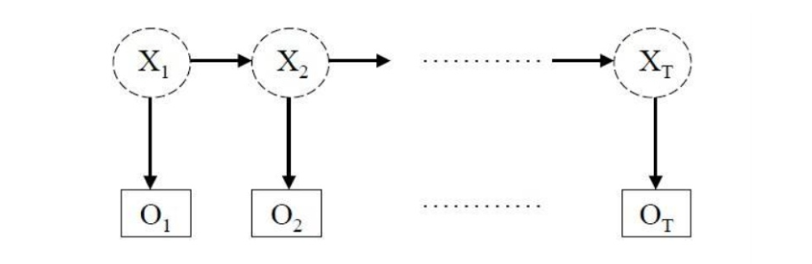

# **源代码分析**

这部分对NLTK库源代码分析   

分析算法的具体实现和代码架构

## **代码架构**

NLTK的各个功能实现在各个包里，大部分包（chunk、tag、tokenize、classify等等）集成了解决对应自然语言处理任务的多种机器学习算法的实现。   

这些包整体上按照接口模式进行架构，每一个包对应一种自然语言处理任务：
+ api.py文件中定义了接口，包含特定自然语言任务需要的方法和常量。通过接口，使用者可以用统一的方式使用统一的方法完成相应的任务。包中的所有模型都应该实现接口中定义的所有方法。
+ util.py文件中定义了多个模型需要的通用的工具方法。
+ 其余每个文件对应了一种特定自然语言处理任务的算法的实现，每个模型都需要基于接口定义的方法来实现对应的算法。文件的内容包含两个部分：第一部分是算法实现有关的类，第二部分是类需要的工具方法。

### **架构示例**

下面以tag包为例，展示这种架构

tag包中的api.py文件定义了TaggerI接口，其中注解为@abstractmethod是需要模型实现的抽象方法，其他没有注解的方法则是基于抽象方法实现的功能方法。

python语言没有接口相关的定义，python通过抽象类实现Interface，通过抽象方法定义接口的派生类需要实现的方法。

#### **接口定义**

TaggerI接口可以看成是对整个Tag任务的功能抽象，可以对Tag任务进行进一步抽象，如将基于特征集进行Tag任务的模型进行抽象，得到FeaturesetTaggerI接口，这里需要注意FeaturesetTaggerI是基于TaggerI定义的，是TaggerI的子类。

```python
class TaggerI(metaclass=ABCMeta):
    """
    给token序列中的每个token打上标记
    """

    @abstractmethod
    def tag(self, tokens):
        """
        采用某一标记算法给token序列打上标记，返回标记后的token序列
        """
        if overridden(self.tag_sents):
            return self.tag_sents([tokens])[0]

    def tag_sents(self, sentences):
        """
        给句子序列中的每一句（一句对应一个token序列）打标记
        """
        return [self.tag(sent) for sent in sentences]

    @deprecated("Use accuracy(gold) instead.")
    def evaluate(self, gold):
        return self.accuracy(gold)

    def accuracy(self, gold):
        """
        将gold作为正确的标注结果，计算实际标注结果的准确率
        """
        tagged_sents = self.tag_sents(untag(sent) for sent in gold)
        gold_tokens = list(chain.from_iterable(gold))
        test_tokens = list(chain.from_iterable(tagged_sents))
        return accuracy(gold_tokens, test_tokens)

    @lru_cache(maxsize=1)
    def _confusion_cached(self, gold):
        """
        将gold作为正确的标注结果，计算实际标注结果对应的混淆矩阵
        """
        tagged_sents = self.tag_sents(untag(sent) for sent in gold)
        gold_tokens = [token for _word, token in chain.from_iterable(gold)]
        test_tokens = [token for _word, token in chain.from_iterable(tagged_sents)]
        return ConfusionMatrix(gold_tokens, test_tokens)

    def confusion(self, gold):
        """
        封装_confusion_cached，给外界调用
        """

        return self._confusion_cached(tuple(tuple(sent) for sent in gold))

    def recall(self, gold) -> Dict[str, float]:
        """
        将gold作为正确的标注结果，计算实际标注结果的召回率
        """

        cm = self.confusion(gold)
        return {tag: cm.recall(tag) for tag in cm._values}

    def precision(self, gold):
        """
        将gold作为正确的标注结果，计算实际标注结果的精确率
        """

        cm = self.confusion(gold)
        return {tag: cm.precision(tag) for tag in cm._values}

    def f_measure(self, gold, alpha=0.5):
        """
        将gold作为正确的标注结果，计算实际标注结果的f-score，alpha为计算中false-negative的权重
        """
        cm = self.confusion(gold)
        return {tag: cm.f_measure(tag, alpha) for tag in cm._values}

    def evaluate_per_tag(self, gold, alpha=0.5, truncate=None, sort_by_count=False):
        """
        对于每个tag计算其对应的recall、precision和f-score，并用表格的形式展示
        """
        cm = self.confusion(gold)
        return cm.evaluate(alpha=alpha, truncate=truncate, sort_by_count=sort_by_count)

    def _check_params(self, train, model):
        if (train and model) or (not train and not model):
            raise ValueError("Must specify either training data or trained model.")
```

#### **工具方法**

util.py文件中则定义了Tag任务需要使用的工具方法

```python
def str2tuple(s, sep="/"):
    """
    将带标记的字符串形式的token转换为tuple
    """
    loc = s.rfind(sep)
    if loc >= 0:
        return (s[:loc], s[loc + len(sep) :].upper())
    else:
        return (s, None)


def tuple2str(tagged_token, sep="/"):
    """
    将带标记的tuple形式的token转换为字符串
    """
    word, tag = tagged_token
    if tag is None:
        return word
    else:
        assert sep not in tag, "tag may not contain sep!"
        return f"{word}{sep}{tag}"


def untag(tagged_sentence):
    """
    对于已经标记的句子，返回这个句子未标记的版本
    """
    return [w for (w, t) in tagged_sentence]
```

#### **模型实现**

在tag包中基于感知机``percptron``、条件随机场``crf``、隐马尔可夫链``HMM``等算法实现Tagger来处理词性标注Tag任务，每一个实际进行Tag任务的Tagger类都需要以TaggerI或FeatureTaggerI为父类

```python
class HiddenMarkovModelTagger(TaggerI):
    pass

class CRFTagger(TaggerI):
    pass 

class BrillTagger(TaggerI):
    pass 

class PerceptronTagger(TaggerI):
    pass 

class StanfordTagger(TaggerI):
    pass
```

### **算法实现示例 —— HMM**

这里以基于隐马尔可夫链算法实现的模型HiddenMarkovModelTagger为例，分析NLTK对特定机器学习算法的实现 

#### **基本性质** 

隐马尔可夫模型HMM主要用于为数据序列中的每一个数据分配正确的标签和评估根据数据序列生成给定标签序列的概率。   

HMM通过从可观察的标签序列中确定标签序列生成过程中的隐含的状态，利用这些状态和状态-标签之间转换的概率进行进一步的分析。

HMM模型是有限状态机，其中的特征是状态、状态之间的转换和每个状态输出的标签符号。  

HMM中observation代表着某个状态对应的一个概率函数。   

HMM基于马尔可夫链的假设，从一个状态转换到另一个状态的概率只取决于当前状态。  

HMM基于Viterbi算法找到给定状态序列生成的最大概率的标签序列。

基于以上内容，可以看出HMM具有时不变性质，即将HMM中的状态序列进行位移生成的标签序列等于HMM基于位移前的状态序列生成的标签序列在内容上是一致的。（时间的变化不会影响标签序列的生成）

#### **HMM特征表示**

HMM本质上是一个有向图，每条边的权重为概率（状态到标签的概率，状态到状态的概率），每个状态会非确定性的生成一个标签，外界可以看到HMM的输出的标签序列，对应的状态序列不可见，


计算过程中HMM的特征如下：
+ 输出的标签序列
+ 状态集 
+ 从某一状态转换到另一个状态的概率 $a_{ij} = P(s_t = j | s_{t-1} = i), s_t$为t时刻的状态
+ 从某一状态生成某一标签的概率 $b_i(k) = P(o_t = k | s_t = i), o_t$为t时刻的标签
+ 初始状态概率分布，第一个状态是某一状态的概率 

#### **具体实现**

HMM分为两个部分，第一部分是使用HMM进行标签序列的生成，第二部分是训练HMM，找到最合适的的状态参数。

下面解析HiddenMarkovModelTagger中的主要方法和实现方式。

这里需要注意，对于词性标注任务，状态是word，标签是tag

NLTK中HMM的生成和训练如下：
```python
class HiddenMarkovModelTagger(TaggerI):
    """
    HiddenMarkovModelTagger的初始化需要以下参数
    symbols：标签序列
    states：状态序列，需要自己给出
    transitions：从某一状态转换到另一个状态的概率，基于ConditionalProbDistI接口
    outputs：从某一状态生成某一标签的概率，基于ConditionalProbDistI
    priors：初始状态的概率分布，基于ProbDistI
    transform：用于转换状态序列，可选，默认不做任何转换
    """

    def __init__(
        self, symbols, states, transitions, outputs, priors, transform=_identity
    ):
        # 将状态集和标签集去重
        self._symbols = unique_list(symbols) 
        self._states = unique_list(states) 
        self._transitions = transitions
        self._outputs = outputs
        self._priors = priors
        self._cache = None
        self._transform = transform

    @classmethod
    def _train(
        cls, labeled_sequence, test_sequence=None, unlabeled_sequence=None, transform=_identity, estimator=None, **kwargs,
    ):
        # HMM的训练过程，这里需要注意，对于带有标签的状态序列使用监督学习模式
        if estimator is None:
            def estimator(fd, bins):
                return LidstoneProbDist(fd, 0.1, bins)

        labeled_sequence = LazyMap(transform, labeled_sequence)
        symbols = unique_list(word for sent in labeled_sequence for word, tag in sent)
        tag_set = unique_list(tag for sent in labeled_sequence for word, tag in sent)

        trainer = HiddenMarkovModelTrainer(tag_set, symbols)
        # 监督学习方法根据带标签的状态序列，训练生成多个概率矩阵（初始概率，状态转移概率，状态生成标签概率）
        hmm = trainer.train_supervised(labeled_sequence, estimator=estimator)
        hmm = cls(
            hmm._symbols,
            hmm._states,
            hmm._transitions,
            hmm._outputs,
            hmm._priors,
            transform=transform,
        )

        if test_sequence:
            hmm.test(test_sequence, verbose=kwargs.get("verbose", False))

        if unlabeled_sequence:
            max_iterations = kwargs.get("max_iterations", 5)
            # 如果存在无标签的状态序列，在原模型的基础上使用无监督学习加强训练，并进行测试
            hmm = trainer.train_unsupervised(
                unlabeled_sequence, model=hmm, max_iterations=max_iterations
            )
            if test_sequence:
                hmm.test(test_sequence, verbose=kwargs.get("verbose", False))

        return hmm
```

HMM的应用主要有三个方面的问题：

**应用问题**：已知模型参数和标签序列的情况下（状态序列是否已知不重要），计算标签序列出现的概率

HMM通过probability方法计算标签序列出现的概率，采用前向或者后向算法进行计算，代码中采用前向算法

```python
    def probability(self, sequence):
        return 2 ** (self.log_probability(self._transform(sequence)))

    def log_probability(self, sequence):
        """
        如果sequence是带有标签的状态序列，返回sequence中的状态序列生成标签序列的概率，

        如果sequence是不带状态的标签序列，计算标签序列出现概率的方法是，算出每个可能的状态序列生成标签序列的概率并求和。
        等价于：返回标签序列生成最后一个状态（最后一个状态可能是标签集合中任意一个标签）的概率之和

        因为序列长度比较长时，序列生成概率比较小，所以这里用对数的形式计算使得最后的结果更精准
        """
        sequence = self._transform(sequence) # 对序列进行转换，默认不转换

        T = len(sequence)

        if T > 0 and sequence[0][_TAG]:
            # 第一个标签的概率的对数为生成第一个状态的概率的对数加上第一个状态生成第一个标签的概率
            last_state = sequence[0][_TAG]
            p = self._priors.logprob(last_state) + self._output_logprob(
                last_state, sequence[0][_TEXT]
            ) 
            # 生成第i个标签的概率的对数为第i-1个状态转换到第i个状态的概率的对数加上第i个状态生成第i个标签的概率
            for t in range(1, T):
                state = sequence[t][_TAG]
                p += self._transitions[last_state].logprob(
                    state
                ) + self._output_logprob(state, sequence[t][_TEXT])
                last_state = state
            return p
        else:
            alpha = self._forward_probability(sequence)
            p = logsumexp2(alpha[T - 1])
            return p
```

前向算法是一个递推算法
+ 标签序列记为$[t_1, t_2, ..., t_T]$，状态序列为$[s_1, s_2, ..., s_T]$，状态集为$[o_1, o_2, ..., o_N]$，这里$t_i$是固定值，$s_i$非定值
+ $transition[i, k] = log(P(s_n = o_k | s_{n-1} = o_i)), n - 1 > 0$
+ $\lambda$表示模型中的参数

前向算法用alpha矩阵计算标签序列的概率，alpha矩阵为 T x N矩阵（T为序列长度，N为状态集大小），矩阵中的某个元素用来表示标签序列的某个前缀序列对应的状态序列最后一个状态为某个特定状态的概率。因为生成概率经过不断的乘法累积会变得比较小，所以用对数表示会更加方便计算。
+ $alpha[n, k] = log(P(t_1, t_2, ..., t_n, s_n = o_k | \lambda))$
+ $alpha[1, k] = log(P(s_1 = o_k | \lambda) * P(t_1 | s_1 = o_k))$

注意到对于长度为n的标签序列，其状态序列中最后一个状态为o_k的概率，为所有的前继状态（第n-1个状态）的概率乘以前继状态转移到o_k的概率再乘以o_k生成第n个标签的概率之和。具体推导如下：
+ $P(t_1, t_2, ..., t_n, s_n = o_k | \lambda) = \sum_{i=1}^N P(t_1, t_2, ..., t_{n-1}, s_n = o_i | \lambda) * P(s_n = o_k | s_{n-1} = o_i) * P(t_n | s_n = o_k) $
+ $alpha[n, k] = log(2^{output[k, t_n]} * \sum_{i=1}^N 2^{alpha[n-1,i] + transition[i, k]})$ 

```python
     def _forward_probability(self, unlabeled_sequence):
        T = len(unlabeled_sequence)
        N = len(self._states)
        alpha = _ninf_array((T, N))

        transitions_logprob = self._transitions_matrix()

        # Initialization
        # alpha[0, k]等于状态k的初始生成概率和状态k生成第一个标签的概率
        symbol = unlabeled_sequence[0][_TEXT]
        for i, state in enumerate(self._states):
            alpha[0, i] = self._priors.logprob(state) + self._output_logprob(
                state, symbol
            )

        # 不断前向传播，alpha[t, k]的概率为 第t-1个状态为任意状态i的概率乘以状态i转移到状态k的概率再求和，最后乘以状态k生成第k个标签的概率
        # 这里注意保存的概率是概率的对数，所以在计算下一个概率的对数的时候需要用logsumexp2计算
        for t in range(1, T):
            symbol = unlabeled_sequence[t][_TEXT]
            output_logprob = self._outputs_vector(symbol)

            for i in range(N):
                summand = alpha[t - 1] + transitions_logprob[i]
                alpha[t, i] = logsumexp2(summand) + output_logprob[i]

        return alpha
```

后向算法也是递推算法
+ 标签序列记为$[t_1, t_2, ..., t_T]$，状态序列为$[s_1, s_2, ..., s_T]$，状态集为$[o_1, o_2, ..., o_N]$，这里$t_i$是固定值，$s_i$非定值
+ $transition[i, k] = log(P(s_n = o_k | s_{n-1} = o_i)), n - 1 > 0$
+ $prior[i] = log(P(s_1 = o_i | \lambda))$

后向算法从后往前进行递推，beta矩阵表示某个后缀标签序列的前一个状态为某个特定状态的概率，即后面的标签序列为$[t_{n+1}, ..., t_T]$时，第n个状态为某一特定状态的概率，表达式如下：
+ $beta[n, k] = log(P(t_T, t_{T-1}, ..., t_{n+1} | s_n = o_k , \lambda))$
+ $beta[T, k] = log(1)$

递推方式的推导过程如下：
+ $P(t_T, t_{T-1}, ..., t_{n+1} | s_n = o_k , \lambda) = \sum_{i=1}^N P(t_T, t_{T-1}, ..., t_{n+1}, s_{n+1} = o_i | s_n = o_k , \lambda) = \sum_{i=1}^N P(t_T, t_{T-1}, ..., t_{n+2} | s_{n+1} = o_i, \lambda) * P (s_{n+1} = o_i | s_n = o_k) * P(t_{n+1} | s_{n + 1} = o_i) $
+ $beta[n, k] = log(P(t_T, t_{T-1}, ..., t_{n+1} | s_n = o_k , \lambda)) = log(\sum_{i=1}^N 2^{transition[i, k] * P(t_{n+1} | s_{n + 1} = o_i) * beta[n + 1, i]})$
+ 最终概率$P = \sum_{i=1}^N beta[1, i] * prior[i] * P(t_1 | s_1 = o_i)$

```python
    def _backward_probability(self, unlabeled_sequence):
        T = len(unlabeled_sequence)
        N = len(self._states)
        beta = _ninf_array((T, N))

        transitions_logprob = self._transitions_matrix().T

        # initialise the backward values;
        # "1" is an arbitrarily chosen value from Rabiner tutorial
        beta[T - 1, :] = np.log2(1)

        # inductively calculate remaining backward values
        for t in range(T - 2, -1, -1):
            symbol = unlabeled_sequence[t + 1][_TEXT]
            outputs = self._outputs_vector(symbol)

            for i in range(N):
                summand = transitions_logprob[i] + beta[t + 1] + outputs
                beta[t, i] = logsumexp2(summand)

        return beta
```

**预测问题**：也叫做解码问题，已知模型参数和标签序列，找到最可能的状态序列，使用Viterbi算法求解  

对于长度为T的标签序列，状态集的大小为N，则可能的状态序列的数量为$N^T$个，每个状态序列生成这个标签序列的概率是不同的，找到概率最大的那个状态序列。  
对应的Viterbi算法如下：
+ 标签序列记为$[t_1, t_2, ..., t_T]$，可能的状态序列为$[s_1, s_2, ..., s_T]$，状态集为$[o_1, o_2, ..., o_N]$
+ $P(t_1, t_2, ..., t_n | s_1, ..., s_n) = P(t_1, t_2, ..., t_{n-1} | s_1, s_2, ..., s_{n-1}) * P(s_n | s_{n-1}) * P(t_n | s_n) $
+ $V[n, k] = max(P(t_1, t_2, ..., t_n, s_n = o_k)) $即第n个状态为$o_k$的序列中最可能生成$[t_1, t_2, ..., t_n]$的状态序列的概率
+ $V[n, k] = max(V[n - 1, i] * X(o_i, o_k)) * O(o_k, t_n), i \in {1, ..., N}$

```python
    def _best_path(self, unlabeled_sequence):
        """
        unlabeled_sequence为一个标签序列，该函数负责找到最有可能的状态序列（状态序列生成这个标签序列的可能性最大）
        The cache is a tuple (P, O, X, S) where:
          - S 代表标签字典，一个标签对应一个序号
          - O 代表状态生成标签概率矩阵
          - X 代表状态转移概率矩阵
          - P 代表第一个状态是状态k的概率
        整体的算法如下：动态规划算法
        标签序列记为[t1, t2]
        最重要找的状态序列是[a1, a2, ..., at]这个序列在所有的序列中生成这个标签序列的可能性最大
        
        """
        unlabeled_sequence = self._transform(unlabeled_sequence)
        T = len(unlabeled_sequence)
        N = len(self._states)
        # 使用cache缓存计算所需的参数
        self._create_cache()
        self._update_cache(unlabeled_sequence)
        P, O, X, S = self._cache

        V = np.zeros((T, N), np.float32) # V[t, k] 根据前t个标签的序列生成的若干状态序列[a1, a2, ..., at = k]中概率最大的状态序列的概率 
        B = -np.ones((T, N), int) # B[t, k]  V[t, k]对应的序列中第t-1个状态

        V[0] = P + O[:, S[unlabeled_sequence[0]]]
        for t in range(1, T):
            for j in range(N):
                vs = V[t - 1, :] + X[:, j]
                best = np.argmax(vs) # 找到概率最大的状态序列
                V[t, j] = vs[best] + O[j, S[unlabeled_sequence[t]]]
                B[t, j] = best

        # 倒序找到概率最大的状态序列
        current = np.argmax(V[T - 1, :])
        sequence = [current]
        for t in range(T - 1, 0, -1):
            last = B[t, current]
            sequence.append(last)
            current = last

        sequence.reverse()
        return list(map(self._states.__getitem__, sequence))
```

HMM支持计算标签序列的熵
+ 信息熵的计算为 $\sum p * log(p)$
+ 熵的计算方法为$\sum P(s_1, s_2, ..., s_T | t_1, t_2, ..., t_T) log(P(s_1, s_2, ..., s_n| t_1, t_2, ..., t_T)$
+ 这里计算就是根据标签序列生成状态序列的概率计算熵
+ $P(t_1, t_2, ..., t_T)$即标签序列的产生概率前面已经论述过计算方法
+ $P(s_1, s_2, ..., s_T | t_1, t_2, ..., t_T) = \frac{P(s_1, s_2, ..., s_T, t_1, t_2, ..., t_T)}{P(t_1, t_2, ..., t_T)}$

现在论述怎么计算熵
+ $alpha[n, k] = log(P(t_1, t_2, ..., t_n, s_n = o_k | \lambda))$
+ $beta[n, k] = log(P(t_T, t_{T-1}, ..., t_{n+1} | s_n = o_k , \lambda))$
+ $alpha[n, k] + beta[n, k] = log(P(t_1, t_2, ..., t_n, s_1 = o_k | \lambda) * P(t_T, t_{T-1}, ..., t_{n+1} | s_n = o_k , \lambda)) = log(P(t_1, t_2, ..., t_T, s_n = o_k | \lambda))$
+ $alpha[n, k] + beta[n+1, i] + transition[k][i] + output[i][t_{n+1}] = log(P(t_1, ..., t_n, s_n = o_k | \lambda) * P(t_T, t_{T-1}, ..., t_{n+2} | s_{n+1} = o_i , \lambda) * P(s_{n+1}=o_i | s_n=o_k) * P(t_{n+1} | s_{n+1}=o_i)) = log(P(t_1, ..., t_T, s_n = o_k, s_{n+1} = o_i)$

```python
    def entropy(self, unlabeled_sequence):
        unlabeled_sequence = self._transform(unlabeled_sequence)

        T = len(unlabeled_sequence)
        N = len(self._states)

        alpha = self._forward_probability(unlabeled_sequence)
        beta = self._backward_probability(unlabeled_sequence)
        normalisation = logsumexp2(alpha[T - 1]) # 标签序列的概率

        entropy = normalisation

        # starting state, t = 0
        for i, state in enumerate(self._states):
            p = 2 ** (alpha[0, i] + beta[0, i] - normalisation)
            entropy -= p * self._priors.logprob(state)

        # state transitions
        for t0 in range(T - 1):
            t1 = t0 + 1
            for i0, s0 in enumerate(self._states):
                for i1, s1 in enumerate(self._states):
                    p = 2 ** (
                        alpha[t0, i0]
                        + self._transitions[s0].logprob(s1)
                        + self._outputs[s1].logprob(unlabeled_sequence[t1][_TEXT])
                        + beta[t1, i1]
                        - normalisation
                    )
                    entropy -= p * self._transitions[s0].logprob(s1)

        # symbol emissions
        for t in range(T):
            for i, state in enumerate(self._states):
                p = 2 ** (alpha[t, i] + beta[t, i] - normalisation)
                entropy -= p * self._outputs[state].logprob(
                    unlabeled_sequence[t][_TEXT]
                )

        return entropy

    def point_entropy(self, unlabeled_sequence):
        """
        Returns the pointwise entropy over the possible states at each
        position in the chain, given the observation sequence.
        """
        unlabeled_sequence = self._transform(unlabeled_sequence)

        T = len(unlabeled_sequence)
        N = len(self._states)

        alpha = self._forward_probability(unlabeled_sequence)
        beta = self._backward_probability(unlabeled_sequence)
        normalisation = logsumexp2(alpha[T - 1])

        entropies = np.zeros(T, np.float64)
        probs = np.zeros(N, np.float64)
        for t in range(T):
            for s in range(N):
                probs[s] = alpha[t, s] + beta[t, s] - normalisation

            for s in range(N):
                entropies[t] -= 2 ** (probs[s]) * probs[s]

        return entropies

    def _exhaustive_entropy(self, unlabeled_sequence):
        unlabeled_sequence = self._transform(unlabeled_sequence)

        T = len(unlabeled_sequence)
        N = len(self._states)

        labellings = [[state] for state in self._states]
        for t in range(T - 1):
            current = labellings
            labellings = []
            for labelling in current:
                for state in self._states:
                    labellings.append(labelling + [state])

        log_probs = []
        for labelling in labellings:
            labeled_sequence = unlabeled_sequence[:]
            for t, label in enumerate(labelling):
                labeled_sequence[t] = (labeled_sequence[t][_TEXT], label)
            lp = self.log_probability(labeled_sequence)
            log_probs.append(lp)
        normalisation = _log_add(*log_probs)

        entropy = 0
        for lp in log_probs:
            lp -= normalisation
            entropy -= 2 ** (lp) * lp

        return entropy

    def _exhaustive_point_entropy(self, unlabeled_sequence):
        unlabeled_sequence = self._transform(unlabeled_sequence)

        T = len(unlabeled_sequence)
        N = len(self._states)

        labellings = [[state] for state in self._states]
        for t in range(T - 1):
            current = labellings
            labellings = []
            for labelling in current:
                for state in self._states:
                    labellings.append(labelling + [state])

        log_probs = []
        for labelling in labellings:
            labelled_sequence = unlabeled_sequence[:]
            for t, label in enumerate(labelling):
                labelled_sequence[t] = (labelled_sequence[t][_TEXT], label)
            lp = self.log_probability(labelled_sequence)
            log_probs.append(lp)

        normalisation = _log_add(*log_probs)

        probabilities = _ninf_array((T, N))

        for labelling, lp in zip(labellings, log_probs):
            lp -= normalisation
            for t, label in enumerate(labelling):
                index = self._states.index(label)
                probabilities[t, index] = _log_add(probabilities[t, index], lp)

        entropies = np.zeros(T, np.float64)
        for t in range(T):
            for s in range(N):
                entropies[t] -= 2 ** (probabilities[t, s]) * probabilities[t, s]

        return entropies
```

**学习问题**：模型参数未知，推断模型参数。
有两种可能的场景：
+ 监督学习的场景，已知诸多标签序列和对应的状态序列，推断模型参数，学习方法相对简单。
+ 非监督学习的场景，只知道诸多标签序列，推断模型参数，一般使用EM期望最大化方法进行迭代求解。

```python
class HiddenMarkovModelTrainer:
    """
    训练器的初始化只需要可能的状态序列和标签序列
    """
    def __init__(self, states=None, symbols=None):
        self._states = states if states else []
        self._symbols = symbols if symbols else []

    def train(self, labeled_sequences=None, unlabeled_sequences=None, **kwargs):
        """
        根据标签序列是否带有状态序列选择有选择还是无选择洗脸
        """
        assert labeled_sequences or unlabeled_sequences
        model = None
        if labeled_sequences:
            model = self.train_supervised(labeled_sequences, **kwargs)
        if unlabeled_sequences:
            if model:
                kwargs["model"] = model
            model = self.train_unsupervised(unlabeled_sequences, **kwargs)
        return model

    def _baum_welch_step(self, sequence, model, symbol_to_number):

        N = len(model._states)
        M = len(model._symbols)
        T = len(sequence)

        # compute forward and backward probabilities
        alpha = model._forward_probability(sequence)
        beta = model._backward_probability(sequence)

        # find the log probability of the sequence
        lpk = logsumexp2(alpha[T - 1])

        A_numer = _ninf_array((N, N))
        B_numer = _ninf_array((N, M))
        A_denom = _ninf_array(N)
        B_denom = _ninf_array(N)

        transitions_logprob = model._transitions_matrix().T

        for t in range(T):
            symbol = sequence[t][_TEXT]  # not found? FIXME
            next_symbol = None
            if t < T - 1:
                next_symbol = sequence[t + 1][_TEXT]  # not found? FIXME
            xi = symbol_to_number[symbol]

            next_outputs_logprob = model._outputs_vector(next_symbol)
            alpha_plus_beta = alpha[t] + beta[t]

            if t < T - 1:
                numer_add = (
                    transitions_logprob
                    + next_outputs_logprob
                    + beta[t + 1]
                    + alpha[t].reshape(N, 1)
                )
                A_numer = np.logaddexp2(A_numer, numer_add)
                A_denom = np.logaddexp2(A_denom, alpha_plus_beta)
            else:
                B_denom = np.logaddexp2(A_denom, alpha_plus_beta)

            B_numer[:, xi] = np.logaddexp2(B_numer[:, xi], alpha_plus_beta)

        return lpk, A_numer, A_denom, B_numer, B_denom

    def train_unsupervised(self, unlabeled_sequences, update_outputs=True, **kwargs):
        """
        Trains the HMM using the Baum-Welch algorithm to maximise the
        probability of the data sequence. This is a variant of the EM
        algorithm, and is unsupervised in that it doesn't need the state
        sequences for the symbols. The code is based on 'A Tutorial on Hidden
        Markov Models and Selected Applications in Speech Recognition',
        Lawrence Rabiner, IEEE, 1989.

        :return: the trained model
        :rtype: HiddenMarkovModelTagger
        :param unlabeled_sequences: the training data, a set of
            sequences of observations
        :type unlabeled_sequences: list

        kwargs may include following parameters:

        :param model: a HiddenMarkovModelTagger instance used to begin
            the Baum-Welch algorithm
        :param max_iterations: the maximum number of EM iterations
        :param convergence_logprob: the maximum change in log probability to
            allow convergence
        """

        # create a uniform HMM, which will be iteratively refined, unless
        # given an existing model
        model = kwargs.get("model")
        if not model:
            priors = RandomProbDist(self._states)
            transitions = DictionaryConditionalProbDist(
                {state: RandomProbDist(self._states) for state in self._states}
            )
            outputs = DictionaryConditionalProbDist(
                {state: RandomProbDist(self._symbols) for state in self._states}
            )
            model = HiddenMarkovModelTagger(
                self._symbols, self._states, transitions, outputs, priors
            )

        self._states = model._states
        self._symbols = model._symbols

        N = len(self._states)
        M = len(self._symbols)
        symbol_numbers = {sym: i for i, sym in enumerate(self._symbols)}

        # update model prob dists so that they can be modified
        # model._priors = MutableProbDist(model._priors, self._states)

        model._transitions = DictionaryConditionalProbDist(
            {
                s: MutableProbDist(model._transitions[s], self._states)
                for s in self._states
            }
        )

        if update_outputs:
            model._outputs = DictionaryConditionalProbDist(
                {
                    s: MutableProbDist(model._outputs[s], self._symbols)
                    for s in self._states
                }
            )

        model.reset_cache()

        # iterate until convergence
        converged = False
        last_logprob = None
        iteration = 0
        max_iterations = kwargs.get("max_iterations", 1000)
        epsilon = kwargs.get("convergence_logprob", 1e-6)

        while not converged and iteration < max_iterations:
            A_numer = _ninf_array((N, N))
            B_numer = _ninf_array((N, M))
            A_denom = _ninf_array(N)
            B_denom = _ninf_array(N)

            logprob = 0
            for sequence in unlabeled_sequences:
                sequence = list(sequence)
                if not sequence:
                    continue

                (
                    lpk,
                    seq_A_numer,
                    seq_A_denom,
                    seq_B_numer,
                    seq_B_denom,
                ) = self._baum_welch_step(sequence, model, symbol_numbers)

                # add these sums to the global A and B values
                for i in range(N):
                    A_numer[i] = np.logaddexp2(A_numer[i], seq_A_numer[i] - lpk)
                    B_numer[i] = np.logaddexp2(B_numer[i], seq_B_numer[i] - lpk)

                A_denom = np.logaddexp2(A_denom, seq_A_denom - lpk)
                B_denom = np.logaddexp2(B_denom, seq_B_denom - lpk)

                logprob += lpk

            # use the calculated values to update the transition and output
            # probability values
            for i in range(N):
                logprob_Ai = A_numer[i] - A_denom[i]
                logprob_Bi = B_numer[i] - B_denom[i]

                # We should normalize all probabilities (see p.391 Huang et al)
                # Let sum(P) be K.
                # We can divide each Pi by K to make sum(P) == 1.
                #   Pi' = Pi/K
                #   log2(Pi') = log2(Pi) - log2(K)
                logprob_Ai -= logsumexp2(logprob_Ai)
                logprob_Bi -= logsumexp2(logprob_Bi)

                # update output and transition probabilities
                si = self._states[i]

                for j in range(N):
                    sj = self._states[j]
                    model._transitions[si].update(sj, logprob_Ai[j])

                if update_outputs:
                    for k in range(M):
                        ok = self._symbols[k]
                        model._outputs[si].update(ok, logprob_Bi[k])

                # Rabiner says the priors don't need to be updated. I don't
                # believe him. FIXME

            # test for convergence
            if iteration > 0 and abs(logprob - last_logprob) < epsilon:
                converged = True

            print("iteration", iteration, "logprob", logprob)
            iteration += 1
            last_logprob = logprob

        return model

    def train_supervised(self, labelled_sequences, estimator=None):
        """
        Supervised training maximising the joint probability of the symbol and
        state sequences. This is done via collecting frequencies of
        transitions between states, symbol observations while within each
        state and which states start a sentence. These frequency distributions
        are then normalised into probability estimates, which can be
        smoothed if desired.

        :return: the trained model
        :rtype: HiddenMarkovModelTagger
        :param labelled_sequences: the training data, a set of
            labelled sequences of observations
        :type labelled_sequences: list
        :param estimator: a function taking
            a FreqDist and a number of bins and returning a CProbDistI;
            otherwise a MLE estimate is used
        """

        # default to the MLE estimate
        if estimator is None:
            estimator = lambda fdist, bins: MLEProbDist(fdist)

        # count occurrences of starting states, transitions out of each state
        # and output symbols observed in each state
        known_symbols = set(self._symbols)
        known_states = set(self._states)

        starting = FreqDist()
        transitions = ConditionalFreqDist()
        outputs = ConditionalFreqDist()
        for sequence in labelled_sequences:
            lasts = None
            for token in sequence:
                state = token[_TAG]
                symbol = token[_TEXT]
                if lasts is None:
                    starting[state] += 1
                else:
                    transitions[lasts][state] += 1
                outputs[state][symbol] += 1
                lasts = state

                # update the state and symbol lists
                if state not in known_states:
                    self._states.append(state)
                    known_states.add(state)

                if symbol not in known_symbols:
                    self._symbols.append(symbol)
                    known_symbols.add(symbol)

        # create probability distributions (with smoothing)
        N = len(self._states)
        pi = estimator(starting, N)
        A = ConditionalProbDist(transitions, estimator, N)
        B = ConditionalProbDist(outputs, estimator, len(self._symbols))

        return HiddenMarkovModelTagger(self._symbols, self._states, A, B, pi)
```
